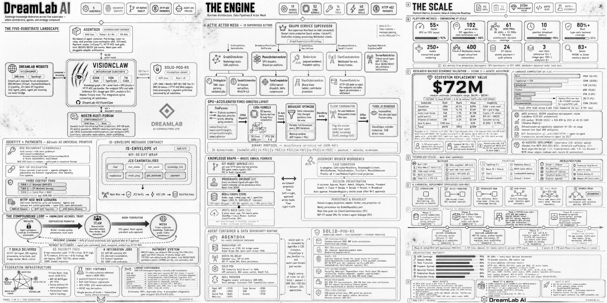
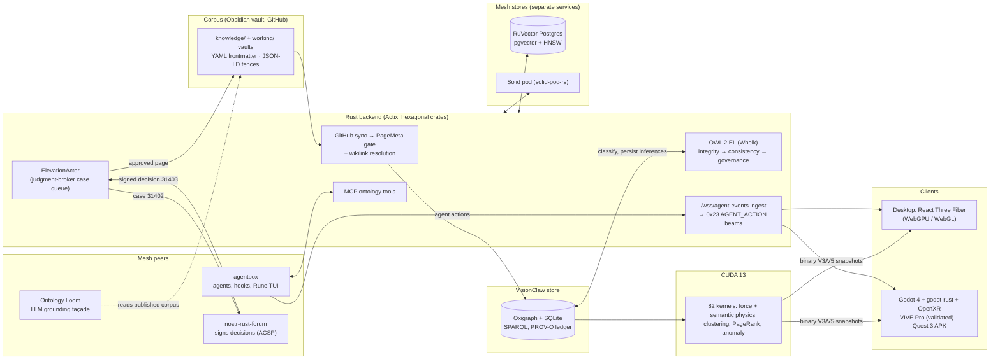

<div align="center">

# VisionClaw

### Watch here, judge there — the flagship engine of the Dynamic Agentic Mesh

**An Obsidian vault as the knowledge corpus · OWL 2 EL reasoning · CUDA force physics · immersive 3D and XR · embodied agent swarms**

[](LICENSE)
[](https://www.rust-lang.org/)
[](https://developer.nvidia.com/cuda-toolkit)
[](docs/README.md)
[](docs/VAULT-corpus-format.md)

**Maintainer**: [John O'Hare](https://github.com/jjohare) · **Upstream IP**: [Melvin Carvalho](https://github.com/melvincarvalho) · [MAINTAINERS.md](MAINTAINERS.md)

<br/>

*Inside a VIVE Pro headset on 2 September 2026: a six-agent swarm embodied in the knowledge graph, every tool call drawn as a beam from the agent to the concept it touched.*

https://github.com/user-attachments/assets/ffb75de6-8961-40f7-b73d-847c8ec8bb50

**Full clip:** [`2026-09-02-immersive-agent-actions.mp4`](docs/assets/media/2026-09-02-immersive-agent-actions.mp4) (109 s, 1280×720, 68 MB, no audio)

<details>
<summary>Earlier clip: the desktop client</summary>

https://github.com/user-attachments/assets/f45c92dc-4800-4b57-a6e2-178da6bb0a38

</details>

</div>

---

## What it is

**Agent swarms are invisible. VisionClaw is a room you can stand inside and watch them work.** A curated corpus of plain markdown is reasoned into a formal ontology, settled as a 3D graph under GPU physics, and rendered on the desktop and in a headset, with agents acting inside it. Judgment stays with a person who signs.

Hierarchy was a way of routing information through people. When AI makes that routing nearly free, the human job changes from router to **judgment broker**: the person who decides at the intersections machines cannot own. VisionClaw is the engine that makes that job visible. Four pieces do the work:

| Pillar | What ships | Where to read more |
|---|---|---|
| **Grounding** | An Obsidian vault of markdown pages ([`jjohare/visionGraph`](https://github.com/jjohare/visionGraph)) compiles losslessly into an OWL 2 EL ontology; the Whelk reasoner classifies every proposed change before it enters the graph. In VisionClaw's own evaluation the ontology lifted F1 from 0.350 to 0.770 on the strongest model tested and cut hallucination from 0.529 to 0.177 across seven models. | [Ontology pipeline](docs/explanation/ontology-pipeline.md) · [Eval data](archive/visionclaw-docs/eval/) · [Vault contract](docs/VAULT-corpus-format.md) |
| **Embodiment** | 82 CUDA kernels turn subclass, part-of and bridge relations into attraction and repulsion, so the shape of the graph is the shape of the knowledge. The same broadcast feeds a React Three Fiber desktop client and a Godot OpenXR client; a node grabbed in one moves in the other. | [GPU wire ABI](docs/GPU-wire-abi.md) · [XR client](docs/XR-client.md) |
| **Judgment broker** | Agents propose; a human answers on the [forum](https://github.com/DreamLab-AI/nostr-rust-forum) with a signed decision. Today this is one case queue (ontology concept elevation, five concurrent cases); the Status table says how far that is from the design. | [Insight loop](docs/explanation/insight-migration-loop.md) · [Status](#status-and-remaining-work) |
| **Identity spine** | One `did:nostr` keypair is login, access-control principal, provenance author and DID subject. The contract is owned upstream in the identity chain, and VisionClaw is one consumer of it. | [Identity chain](docs/IDENTITY-authority-chain.md) |

This shape has a name, **neurosymbolic**: probabilistic agents bounded by formal, machine-checkable semantics. VisionClaw runs that pattern today and lists its gaps below.

---

## Where it sits in the mesh

VisionClaw is the embodiment-and-observation layer of the **Dynamic Agentic Mesh**, the coordination substrate DreamLab AI builds on Nostr events. It was built last, on top of the identity, data sovereignty and signing surface that live in sibling repos; [VisionFlow](https://github.com/DreamLab-AI/VisionFlow) holds the cross-repository canon.



*The August 2026 infographic. A few internals it shows predate the Obsidian migration; the tables below are current.*

| Repo | Role in the mesh |
|---|---|
| **VisionClaw** *(this repo)* | Flagship engine: ontology-grounded immersive knowledge graph, GPU physics, agent embodiment |
| [VisionFlow](https://github.com/DreamLab-AI/VisionFlow) | Canon: ADRs, PRDs, compatibility matrix, the vision report |
| [agentbox](https://github.com/DreamLab-AI/agentbox) | Sovereign agent runtime: Nix-built container, `did:nostr` per agent, 124 skills, RuVector memory, Rune markdown TUI over the vault *(git submodule here)* |
| [nostr-rust-forum](https://github.com/DreamLab-AI/nostr-rust-forum) | The one place a human decision gets signed |
| [solid-pod-rs](https://github.com/DreamLab-AI/solid-pod-rs) | Personal-data sovereignty: a Rust Solid pod server |
| [narrativegoldmine](https://github.com/DreamLab-AI/knowledgeGraph) | The readable front door: 8,433 public pages (the count before the vault split) as an open dataset, rendered at [narrativegoldmine.com](https://narrativegoldmine.com) |
| [dreamlab-ai-website](https://github.com/DreamLab-AI/dreamlab-ai-website) | The commercial face, a thin consumer of the forum kit |

<details>
<summary>Two more pieces VisionClaw depends on</summary>

**The Ontology Loom.** A portable node that grounds any OpenAI-compatible LLM in the corpus behind one stable URL, so the model can be swapped without touching a consumer. On the synthetic corpus a static ontology scaffold raised grounded recall to about 0.94 on both models tested (Gemma 0.15 → 0.94, Muse 0.27 → 0.94) at three to six times lower latency. It runs as one node; the connector platform is unbuilt. Design: [PRD-025](docs/archive/prd/PRD-025-ontology-loom-and-connector-platform.md) · [ADR-135](docs/archive/adr/ADR-135-ontology-loom-node.md) (archived rationale) · deployment: [DreamLab-AI/loom](https://github.com/DreamLab-AI/loom).

**The dream cycle.** A nightly [dream engine](https://github.com/DreamLab-AI/dream-engine) proposes evidence-gated changes to VisionClaw's own code as draft PRs and stops there. A person merges.

</details>

---

## Architecture



A Cargo workspace of extracted crates makes up the backend (`contracts → domain → {gpu, ontology, protocol} → adapters → actors → xr-presence → server`) with hexagonal boundaries and direct dispatch, no CQRS bus. Oxigraph plus SQLite is the single canonical store ([ADR-2004](docs/adr/ADR-2004-oxigraph-sqlite-persistence.md)); the governing documents for stores, identity, data ownership, wire protocol, identifiers, security profiles, GPU ABI, the XR client and the corpus are indexed in [`docs/adr/README.md`](docs/adr/README.md). Longer reads: [System overview](docs/explanation/system-overview.md) · [Bounded contexts](docs/explanation/bounded-contexts.md).

---

## Quick start

```bash
git clone https://github.com/DreamLab-AI/VisionClaw.git
cd VisionClaw && cp env.example .env     # set GITHUB_REPO, GITHUB_BASE_PATH, PRIVATE_REPO_GITHUB_PAT
./scripts/launch.sh up dev
```

`./scripts/launch.sh up dev` is the canonical launcher; the explicit form is `docker compose -f docker-compose.unified.yml --profile dev up -d`. The dev image compiles the Rust backend on first start (a few minutes), then:

| Service | URL |
|:--------|:----|
| Desktop client | http://localhost:3001 |
| REST + WebSocket API | http://localhost:4000/api |

<details>
<summary>Native build with CUDA, and the XR client</summary>

```bash
curl --proto '=https' --tlsv1.2 -sSf https://sh.rustup.rs | sh
cargo build --release --features gpu
cd client && npm install && npm run build && cd ..
./target/release/visionclaw-server
```

Needs a CUDA 13 toolkit; see the [deployment guide](docs/how-to/deployment.md). The Godot client in `xr-client/` builds separately: as a desktop OpenXR app (the path validated on a VIVE Pro) or as a Quest 3 APK ([XR client doc](docs/XR-client.md) · [Quest 3 setup](docs/how-to/xr-quest3-setup.md)).

</details>

---

## Running on 2 September 2026

On this date the corpus moved from Logseq to an Obsidian vault, and one session exercised all three surfaces on the same graph. The engineering record is [`docs/gap-close-evidence/2026-09-02-obsidian-migration-closeout.md`](docs/gap-close-evidence/2026-09-02-obsidian-migration-closeout.md).

| The vault in Obsidian | The desktop client |
|---|---|
|  |  |
| The `knowledge/` vault, graph view, the **SPARQL** page selected. A page enters the knowledge graph when its frontmatter says `public: true` or names an `owl-class`. Agents read and write the same files. | The identical corpus after sync: 13,165 nodes and 154k edges (inferred triples included) under GPU layout, the Ontology panel focused on `urn:ngm:class:sparql`, the class that page maps to. |

<details>
<summary>What the session proved, and how</summary>

- **Conversion is format-neutral.** Syncing the converted corpus and the unconverted one with the same binary produced identical node sets apart from three labels that now honour frontmatter `title`; the final production sync had zero fetch errors.
- **Multi-client sync.** A node grabbed in the headset (`Ethereum`, 3,268 drag updates) moved on the server and stayed pinned 360 units from where it started; every client renders that same broadcast.
- **Agent embodiment.** Six agent nodes (a Fable 5.1 queen, Opus workers, Sonnet researchers) streamed one action every 1.2 s into `/wss/agent-events`; the desktop Agents dock showed the swarm and the KPI tile counted 450 actions. Verb sets the beam's colour and shape: query, link, update, transform, create, delete. Reproduce it with [`docs/how-to/operations/agent-beams-dev-driver.md`](docs/how-to/operations/agent-beams-dev-driver.md).
- **Ten defects found in one day**, from a physics runaway of 316 isolated nodes to filenames containing `%` that had never fetched. Eight are closed, the physics fix awaits GPU re-verification, and one manifest-reader leak is worked around. All listed in the close-out record.

</details>

---

## How it works

**Embodiment.** An agent acting on the graph, the ontology or a pod becomes a transient beam from the agent to its target, with colour and shape encoding the verb; RuVector memory access renders as burst rings on the embedding cloud. Actions arrive on one authenticated socket, `/wss/agent-events`, and leave as the identity-blind `0x23` frame every client understands.

**The insight loop.** The ontology's frontier is the set of classes named by axioms but never authored. The `ElevationActor` ranks it as a work queue, drafts a canonical page, opens a broker case, and waits for a signed human decision; approval commits the draft to the corpus as a pull request and the next sync ingests it.

**The governed write path.** Nothing changes the shared ontology except through one authenticated door with three gates in sequence: integrity (duplicate concepts, subclass cycles, contradictions; its first live run caught two cycles and 57 contradictions the structural validator had missed), Whelk consistency (a reasoner that classifies, not a rule engine that validates), and governance (a signed ACSP decision). The endpoint returns a receipt with one line per gate. Every committed triple gains a content-addressed provenance record in an append-only PROV-O ledger held outside the reasoned graph, attributed to the authenticated `did:nostr`.

<details>
<summary>Protocols: ACSP kinds and the binary graph frame</summary>

**Agent Control Surface Protocol**, Nostr kinds 31400–31405. VisionClaw is a producer: agents publish panel events the forum relay renders as decision surfaces, and only an admin key can publish a signed Decision (31403).

| Kind | Name | Flow |
|---|---|---|
| 31400 | PanelDefinition | Agent declares a control panel |
| 31401 | PanelState | Agent snapshot |
| 31402 | ActionRequest | Agent requests a human decision (broker case) |
| 31403 | ActionResponse | Human approve or reject, admin-only, signed |
| 31404 | PanelUpdate | Agent incremental diff |
| 31405 | PanelRetired | Agent retires a panel |

Contract: [agent-control-surface.md](docs/explanation/agent-control-surface.md) · human approval flow: [ADR-2006](docs/adr/ADR-2006-acsp-human-approval.md).

**Binary graph frame.** Position updates are always full absolute snapshots: V3 is a frozen 52-byte record with an analytics tail, V5 wraps it in an 8-byte broadcast sequence ([ADR-2018](docs/adr/ADR-2018-frozen-52-byte-v3-record-v5-envelope.md)). The GPU broadcasts every node's target at about 10 fps and each client tweens toward it at 60 fps, which is why a delta filter would starve clients of resting positions. Agent co-presence and the `0x23` action beam are additive sibling opcodes ([ADR-2020](docs/adr/ADR-2020-agent-copresence-additive-sibling-opcode.md)). Wire reference: [binary-protocol.md](docs/reference/binary-protocol.md).

</details>

---

## Documentation

Diátaxis layout, backed by the decision record. Start at the [documentation hub](docs/README.md).

| Category | Entry points |
|:---------|:-------------|
| **Explanation** | [System overview](docs/explanation/system-overview.md) · [Ontology pipeline](docs/explanation/ontology-pipeline.md) · [XR architecture](docs/explanation/xr-architecture.md) · [Security model](docs/explanation/security-model.md) · [Bounded contexts](docs/explanation/bounded-contexts.md) · [Insight loop](docs/explanation/insight-migration-loop.md) |
| **Reference** | [REST API](docs/reference/rest-api.md) · [WebSocket](docs/reference/websocket-protocol.md) · [Binary protocol](docs/reference/binary-protocol.md) · [MCP tools](docs/reference/mcp-tools.md) · [Graph schema](docs/reference/graph-schema.md) · [Physics parameters](docs/reference/physics-parameters.md) · [Configuration](docs/reference/configuration.md) |
| **How-to** | [Deployment](docs/how-to/deployment.md) · [Quest 3 setup](docs/how-to/xr-quest3-setup.md) · [Agent beams dev driver](docs/how-to/operations/agent-beams-dev-driver.md) |
| **Governing documents and ledger** | [ADR index and domain table](docs/adr/README.md) · [Vault corpus contract](docs/VAULT-corpus-format.md) · [Work register](docs/TODO-unified.md) · [Known issues](docs/KNOWN_ISSUES.md) |

---

## Status and remaining work

*Dated 2026-09-02. Maturity words: **planned** is designed and not built, **integrated** is wired and exercised on the live stack, **released** has run unattended in production. The canonical register is [`docs/TODO-unified.md`](docs/TODO-unified.md), and each row's governing document carries the `file:line` evidence.*

| Capability | Maturity | Boundary |
|---|---|---|
| OWL 2 EL reasoning (Whelk) | integrated | Running on the live corpus. The class count was audited at 5,975 in August 2026; a divergence against the 8,152 the pipeline counts is still open. |
| SPARQL over Oxigraph | integrated | Sole store; Neo4j is gone ([ADR-2004](docs/adr/ADR-2004-oxigraph-sqlite-persistence.md)). |
| GPU physics | released | Isolated-node runaway fixed 2 September; GPU re-verification pending after the next relaunch. |
| Corpus | integrated | Obsidian vault, `jjohare/visionGraph`; Logseq tolerance kept until [ADR-2040](docs/adr/ADR-2040-obsidian-vault-frontmatter-gate.md)'s review trigger. |
| `did:nostr` identity spine | integrated | One keypair for login, WAC principal, provenance author, DID subject. NIP-98 on write routes is validated twice per request today; the session realm is the workaround. |
| ACSP signed governance | integrated | Six kinds live; one use case (ontology elevation, five concurrent cases). |
| Judgment broker | integrated | `ElevationActor` case queue; the distributed broker in the design is unbuilt. |
| RuVector semantic memory | integrated | agentbox's store (1.17M+ embeddings, bge-small-en-v1.5, 384-dim, HNSW). VisionClaw reads and writes it through the claude-flow MCP tools and renders access as burst rings; the direct HNSW path is off by default. |
| SHACL shapes | integrated | Five shapes enforced by default; a `sh:Violation` rejects the write. |
| PROV-O provenance | integrated | Append-only ledger, queryable at `GET /api/ontology/provenance?entity=<urn>`; emission is fail-open. |
| XR client | integrated | Desktop OpenXR on a VIVE Pro validated with a live swarm (2 September). Quest 3 on-device validation still pending. |
| Agent embodiment | integrated | Beams and capsules live in both clients; the agentbox hook path needs the next image rebuild, and there is no `agent_list` provider yet, so agent nodes are registered by request. |
| Gluon attractive force | planned | The beam ships; the agent-to-target attractive edge waits on a transient-edge GPU buffer. |

**Live-session pending**: envelope canary (L-1), query-clamp canary (L-3), telemetry canary (L-4), Quest 3 on-device (L-5). **Decided 2026-08-31**: XR residue (T-2) and RBAC granularity (T-3).

---

## Contributing and licence

Read the [contributing guide](docs/CONTRIBUTING.md) and [known issues](docs/KNOWN_ISSUES.md) first. Licensed under the [GNU AGPL v3.0-only](LICENSE): running a modified version as a network service means offering its complete source to its users. A proposed MPL 2.0 relicence ships in-tree as `LICENSE.MPL` but is not operative. Maintainers and upstream-IP attribution: [MAINTAINERS.md](MAINTAINERS.md).

<div align="center">

**VisionClaw is the flagship engine of the [VisionFlow](https://github.com/DreamLab-AI/VisionFlow) Dynamic Agentic Mesh, built by [DreamLab AI](https://www.dreamlab-ai.com).**

[Documentation](docs/README.md) · [Work register](docs/TODO-unified.md) · [Close-out record](docs/gap-close-evidence/2026-09-02-obsidian-migration-closeout.md)

</div>
