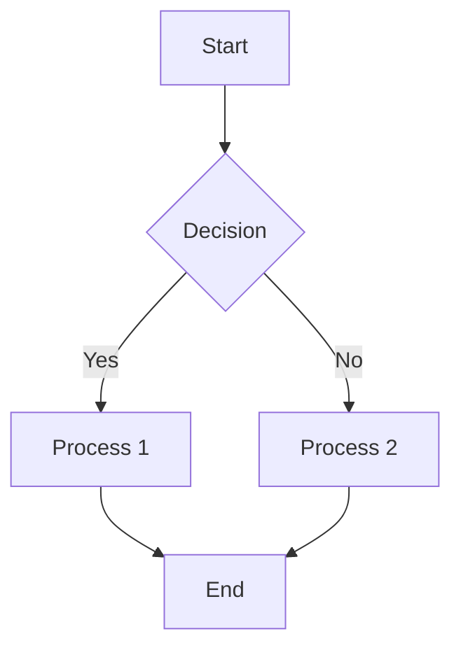
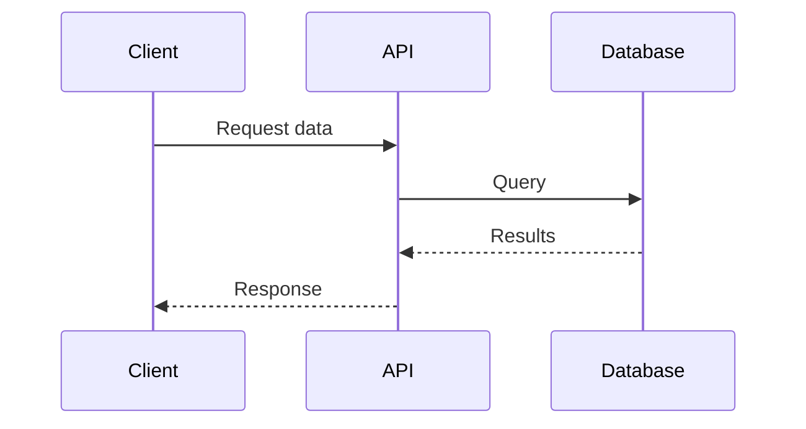
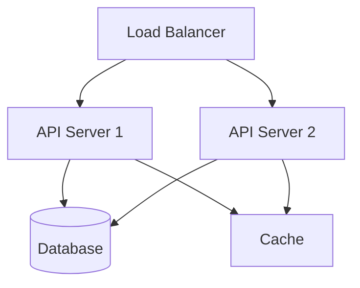
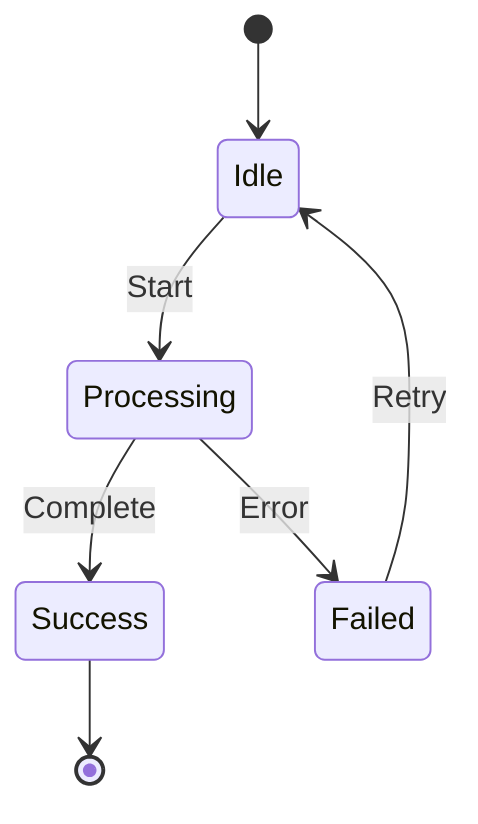

# Documentation Contribution Guide

Welcome to the unified documentation corpus. This guide helps you contribute high-quality documentation.

---

## Table of Contents

1. [Getting Started](#getting-started)
2. [Writing Standards](#writing-standards)
3. [Front Matter Requirements](#front-matter-requirements)
4. [Diagram Guidelines](#diagram-guidelines)
5. [Linking Standards](#linking-standards)
6. [Git Hooks](#git-hooks)
7. [Submission Process](#submission-process)

---

## Getting Started

### Prerequisites

- Git installed and configured
- Text editor with Markdown support
- Basic understanding of Markdown syntax
- Familiarity with Mermaid diagram syntax

### Setup

**1. Clone Repository**

```bash
git clone <repository-url>
cd project/docs
```

**2. Install Validation Tools**

```bash
# Make scripts executable
chmod +x scripts/*.sh

# Test validation
./scripts/validate-all.sh
```

**3. Review Existing Documentation**

Browse `INDEX.md` to understand current documentation structure and standards.

---

## Writing Standards

### Document Structure

Every document should follow this structure:

```markdown
---
title: "Document Title"
description: "Clear one-line description"
category: architecture|development|deployment|api|guides|reference
tags: [tag1, tag2, tag3]
version: 2.0.0
last_updated: 2025-12-18
---

# Document Title

Brief introduction paragraph.

---

## Table of Contents

1. [Section 1](#section-1)
2. [Section 2](#section-2)

---

## Section 1

Content...

### Subsection 1.1

Content...

---

## Section 2

Content...

---

*Last Updated: 2025-12-18*
*Version: 2.0.0*
```

### Writing Style

**Be Clear and Concise**

✅ Good:
```markdown
The system uses Redis for caching frequently accessed data.
```

❌ Avoid:
```markdown
The system architecture leverages Redis as a high-performance,
in-memory data structure store to cache frequently accessed data,
thereby reducing database load and improving response times.
```

**Use Active Voice**

✅ Good:
```markdown
Configure the API key in the environment file.
```

❌ Avoid:
```markdown
The API key should be configured in the environment file.
```

**Define Technical Terms**

```markdown
The system uses **idempotent** operations (operations that produce
the same result regardless of how many times they're executed).
```

### Code Examples

**Use Syntax Highlighting**

```markdown
```bash
npm install package-name
```
```

**Provide Context**

```markdown
Install the required dependencies:

```bash
npm install express dotenv
```

This command installs:
- `express`: Web framework
- `dotenv`: Environment variable management
```

**Show Complete Examples**

Include all necessary imports, configuration, and error handling.

---

## Front Matter Requirements

### Required Fields

All documents must include these fields:

```yaml
---
title: "Document Title"           # Clear, descriptive title
description: "One-line summary"   # Appears in search results
category: reference               # One of: architecture, development, deployment, api, guides, reference
tags: [tag1, tag2, tag3]         # 3-5 relevant tags
version: 2.0.0                    # Semantic version
last_updated: 2025-12-18          # ISO date format (YYYY-MM-DD)
---
```

### Optional Fields

```yaml
---
author: "Your Name"               # Original author
contributors: ["Name 1", "Name 2"] # Additional contributors
deprecated: false                  # Mark as deprecated
replacement: "../new-doc.md"       # Link to replacement doc
related: ["doc1.md", "doc2.md"]   # Related documents
---
```

### Category Guidelines

**architecture**
- System design documents
- Component architecture
- Integration patterns
- Technical decisions

**development**
- Setup guides
- Development workflows
- Testing strategies
- Debugging guides

**deployment**
- Deployment procedures
- Infrastructure setup
- CI/CD pipelines
- Environment configuration

**api**
- REST API documentation
- WebSocket API documentation
- MCP tool references
- API usage examples

**guides**
- Getting started guides
- How-to guides
- Tutorials
- Troubleshooting guides

**reference**
- CLI reference
- Configuration reference
- Glossary
- Cheat sheets

### Tag Guidelines

Use consistent, lowercase tags:

**Technology Tags**
- `docker`, `kubernetes`, `nvidia`, `cuda`, `gpu`
- `nodejs`, `python`, `rust`, `typescript`
- `redis`, `postgresql`, `mongodb`

**Function Tags**
- `deployment`, `configuration`, `setup`, `testing`
- `api`, `cli`, `ui`, `backend`, `frontend`
- `security`, `performance`, `monitoring`

**Type Tags**
- `guide`, `reference`, `tutorial`, `troubleshooting`
- `architecture`, `design`, `patterns`

---

## Diagram Guidelines

### Use Mermaid for All Diagrams

**Never use ASCII art.** All diagrams must use Mermaid syntax.

### Common Diagram Types

**Flowcharts**

```markdown

```

**Sequence Diagrams**

```markdown

```

**Architecture Diagrams**

```markdown

```

**State Diagrams**

```markdown

```

### Diagram Best Practices

1. **Keep diagrams simple** - Focus on key concepts
2. **Use consistent styling** - Maintain visual consistency
3. **Add labels** - Clearly label all nodes and edges
4. **Test syntax** - Validate at [mermaid.live](https://mermaid.live)
5. **Provide context** - Explain diagram before showing it

---

## Linking Standards

### Internal Links

**Use Relative Paths**

✅ Good:
```markdown
See [API Reference](./reference/rest-api.md)
```

❌ Avoid:
```markdown
See [API Reference](/docs/reference/rest-api.md)
```

**Link to Specific Sections**

```markdown
See [API Reference](./reference/rest-api.md#configuration)
```

**Verify Links Exist**

```bash
./scripts/validate-links.sh
```

### External Links

**Include Full URLs**

```markdown
See [Docker Documentation](https://docs.docker.com/)
```

**Use Descriptive Link Text**

✅ Good:
```markdown
Learn more in the [official Redis documentation](https://redis.io/docs/)
```

❌ Avoid:
```markdown
Click [here](https://redis.io/docs/) for documentation
```

### Cross-References

Link to related documents at the end of each section:

```markdown
---

**Related Documentation:**
- [API Reference](./reference/rest-api.md)
- [Configuration Guide](./how-to/operations/configuration.md)
- [Troubleshooting](./how-to/operations/troubleshooting.md)
```

---

## Git Hooks

The repository's hooks are tracked in `.githooks/` and installed by a script.
Nothing installs them automatically, and nothing installs itself during a
commit.

### Installing

```bash
./scripts/install-hooks.sh            # install the hooks
./scripts/install-hooks.sh --status   # show what is installed
./scripts/install-hooks.sh --uninstall
```

The script places each file from `.githooks/` into the repository's effective
hooks directory rather than repointing `core.hooksPath`, so any hook you
installed by hand (`scripts/pre-commit-validate.sh`, for instance) keeps
working. Worktrees share the common git directory, so one install covers every
worktree of the clone. Where the main working tree holds the tracked hooks the
script symlinks to them, so updates arrive without reinstalling; otherwise it
copies, so removing a worktree never leaves a dangling hook. An existing
regular file that is not ours is moved aside to
`<name>.replaced-by-install-hooks` rather than deleted.

### `prepare-commit-msg` and git-gen-utils

`prepare-commit-msg` can draft a commit message with
[git-gen-utils](https://pypi.org/project/git-gen-utils/), a local LLM that
reads your diff. It is off unless you provision it:

```bash
./scripts/install-hooks.sh --with-git-gen
```

That builds one shared virtualenv at `$XDG_CACHE_HOME/git-gen-utils/venv`
(override with `GIT_GEN_UTILS_VENV`) and installs git-gen-utils from upstream's
prebuilt CPU wheel index. git-gen-utils depends on `llama-cpp-python`, which
PyPI carries as a source distribution only, so a plain `pip install` compiles a
C++ tree for several minutes. The installer passes
`--only-binary=llama-cpp-python` against
`https://abetlen.github.io/llama-cpp-python/whl/cpu`, which turns "no wheel for
this platform" into an immediate error instead of a long wait. The wheel links
against the system `libstdc++.so.6`; on minimal or Nix-composed images that
library may be absent, so the installer runs `git-gen --help` once and reports
a failure to start at install time rather than leaving it for a commit.

The hook itself obeys a deliberately narrow contract:

- It never fails a commit. Every path exits 0.
- It never provisions anything: no venv, no `pip install`, no compilation.
- It exits before running a single subprocess whenever git already has a
  message, which covers every `git commit -m`, merge, squash, amend and
  templated commit.
- It only generates for a bare interactive `git commit` with an empty message
  file, and only when the shared environment is already present. Otherwise it
  prints one line and gets out of the way.
- It is worktree-safe: one shared environment, never a per-worktree `.venv`.

Controls:

| Variable | Effect |
|---|---|
| `GIT_GEN_UTILS_DISABLE=1` | Skip generation entirely |
| `GIT_GEN_UTILS_VENV` | Use a different environment |
| `GIT_GEN_UTILS_TIMEOUT` | Generation timeout in seconds, default 60 |

`git commit --no-verify` does **not** bypass `prepare-commit-msg` (git only
skips `pre-commit` and `commit-msg`), which is why the hook must be cheap and
fail-open by construction rather than by opt-out.

If you have a stale per-worktree `.venv` from the earlier version of this hook,
delete it; it is not used any more.

---

## Submission Process

### Before Submitting

**1. Validate Your Changes**

```bash
# Run all validators
./scripts/validate-all.sh

# Check specific aspects
./scripts/validate-links.sh
./scripts/validate-frontmatter.sh
./scripts/validate-mermaid.sh
```

**2. Update Index**

```bash
./scripts/generate-index.sh
```

**3. Generate Reports**

```bash
./scripts/generate-reports.sh
```

**4. Review Changes**

```bash
git diff
```

### Commit Guidelines

**Use Conventional Commits**

```bash
# Documentation updates
git commit -m "docs: add deployment guide for Kubernetes"

# Fixes
git commit -m "fix(docs): correct broken links in API reference"

# Updates
git commit -m "docs: update front matter validation script"
```

**Commit Message Format**

```
<type>(<scope>): <subject>

<body>

<footer>
```

**Types:**
- `docs`: Documentation changes
- `fix`: Bug fixes in documentation
- `feat`: New documentation features
- `chore`: Maintenance tasks

### Pull Request Process

**1. Create Feature Branch**

```bash
git checkout -b docs/your-feature-name
```

**2. Make Changes**

Follow all guidelines in this document.

**3. Commit Changes**

```bash
git add .
git commit -m "docs: your commit message"
```

**4. Push to Remote**

```bash
git push origin docs/your-feature-name
```

**5. Create Pull Request**

- Use descriptive title
- Reference related issues
- Include validation results
- Request review from maintainers

### Pull Request Template

```markdown
## Description

Brief description of changes.

## Changes Made

- [ ] Added new documentation
- [ ] Updated existing documentation
- [ ] Fixed broken links
- [ ] Updated diagrams
- [ ] Updated front matter

## Validation

```bash
./scripts/validate-all.sh
```

Results: All checks passed ✅

## Related Issues

Closes #123

## Checklist

- [ ] Front matter complete and valid
- [ ] All links validated
- [ ] Mermaid diagrams tested
- [ ] No ASCII art diagrams
- [ ] Cross-references added
- [ ] INDEX.md updated
- [ ] Validation passed
```

---

## Review Process

### Reviewer Checklist

Reviewers will check:

- [ ] Front matter complete and valid
- [ ] Clear, concise writing
- [ ] Proper Markdown formatting
- [ ] Mermaid diagrams (no ASCII art)
- [ ] All links valid and working
- [ ] Appropriate tags and category
- [ ] Cross-references to related docs
- [ ] Code examples complete and tested
- [ ] Validation scripts pass
- [ ] INDEX.md updated

### Feedback Implementation

1. Address all reviewer comments
2. Re-run validation scripts
3. Push updates to PR branch
4. Request re-review

---

## Getting Help

### Resources

- [Markdown Guide](https://www.markdownguide.org/)
- [Mermaid Documentation](https://mermaid.js.org/)
- [Conventional Commits](https://www.conventionalcommits.org/)

### Support

- Review [MAINTENANCE.md](./how-to/operations/maintenance.md)
- Check existing documentation in [INDEX.md](./reference/INDEX.md)
- Open an issue for questions
- Contact documentation maintainers

---

## Best Practices Summary

✅ **Do:**
- Write clear, concise documentation
- Use Mermaid for all diagrams
- Include complete front matter
- Add cross-references
- Validate before submitting
- Use relative links
- Provide code examples
- Follow commit conventions

❌ **Don't:**
- Use ASCII art diagrams
- Use absolute paths for internal links
- Submit without validation
- Create orphaned documents
- Use vague link text
- Omit front matter fields
- Write overly long documents
- Leave broken links

---

*Last Updated: 2025-12-18*
*Version: 2.0.0*
