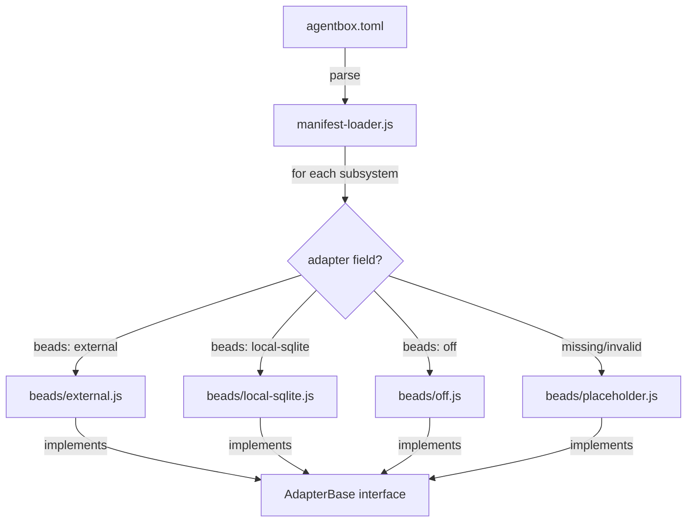
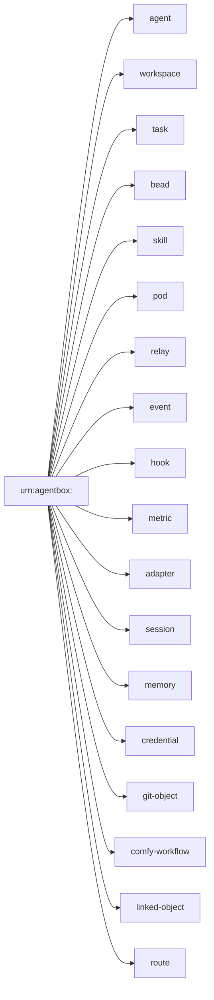

# Agentbox Architecture Map

> Generated: 2026-05-09 | Substrate: `/home/devuser/workspace/project/agentbox/`
> Core files: ~80 (JS/Nix/Shell) | Management API: ~13,700 lines | Nix/Shell: ~5,300 lines

---

## 1. Module Dependency Graph

```mermaid
graph TD
    subgraph Entry["Entry Points"]
        AGENTBOX_SH[agentbox.sh<br/>1146 lines]
        FLAKE[flake.nix<br/>2115 lines]
        ENTRYPOINT[config/entrypoint-unified.sh<br/>601 lines]
    end

    subgraph ManagementAPI["Management API (Express)"]
        SERVER[server.js<br/>915 lines]
        R_EVENTS[routes/agent-events.js<br/>507 lines]
        R_BROKER[routes/broker-bridge.js<br/>597 lines]
        R_GIT[routes/git-bridge.js<br/>755 lines]
        R_TASKS[routes/tasks.js<br/>338 lines]
        R_COMFY[routes/comfyui.js<br/>321 lines]
        R_MEMORY[routes/memory.js<br/>186 lines]
        R_LINKED[routes/linked-objects.js<br/>232 lines]
        R_URI[routes/uri-resolver.js<br/>175 lines]
        R_STATUS[routes/status.js<br/>65 lines]
    end

    subgraph Adapters["Pluggable Adapters (ADR-005)"]
        AD_INDEX[adapters/index.js<br/>140 lines]
        AD_BASE[adapters/base.js<br/>31 lines]
        AD_MANIFEST[adapters/manifest-loader.js<br/>91 lines]

        subgraph Beads["Bead Adapters"]
            B_EXT[beads/external.js<br/>102 lines]
            B_LOCAL[beads/local-sqlite.js<br/>218 lines]
            B_OFF[beads/off.js<br/>27 lines]
            B_PLACE[beads/placeholder.js<br/>30 lines]
        end

        subgraph Events["Event Adapters"]
            E_EXT[events/external.js<br/>68 lines]
            E_LOCAL[events/local-jsonl.js<br/>113 lines]
            E_OFF[events/off.js<br/>29 lines]
            E_PLACE[events/placeholder.js<br/>26 lines]
        end

        subgraph Memory["Memory Adapters"]
            M_EMBED[memory/embedded-ruvector.js<br/>155 lines]
            M_EXT_PG[memory/external-pg.js<br/>186 lines]
            M_OFF[memory/off.js<br/>26 lines]
            M_PLACE[memory/placeholder.js<br/>27 lines]
        end

        subgraph Orchestrator["Orchestrator Adapters"]
            O_LOCAL[orchestrator/local-process-manager.js<br/>125 lines]
            O_OFF[orchestrator/off.js<br/>25 lines]
            O_PLACE[orchestrator/placeholder.js<br/>27 lines]
            O_STDIO[orchestrator/stdio-bridge.js<br/>74 lines]
        end

        subgraph Pods["Pod Adapters"]
            P_SOLID_BASE[pods/_solid-http-base.js<br/>133 lines]
            P_EXT[pods/external.js<br/>36 lines]
            P_LOCAL[pods/local-solid-rs.js<br/>156 lines]
            P_OFF[pods/off.js<br/>26 lines]
            P_PLACE[pods/placeholder.js<br/>28 lines]
        end
    end

    subgraph Middleware["Middleware"]
        MW_AUTH[middleware/auth.js<br/>150 lines]
        MW_LD[middleware/linked-data/<br/>~2,200 lines]
        MW_PRIVACY[middleware/privacy-filter.js<br/>355 lines]
    end

    subgraph LinkedData["Linked Data Pipeline"]
        LD_INDEX[linked-data/index.js<br/>112 lines]
        LD_ENCODER[linked-data/encoder.js<br/>257 lines]
        LD_JCS[linked-data/jcs.js<br/>166 lines]
        LD_CONTEXT[linked-data/context-resolver.js<br/>271 lines]
        LD_LION[linked-data/lion-linter.js<br/>306 lines]
        LD_RT[linked-data/round-trip.js<br/>107 lines]
        LD_SURFACES[linked-data/surfaces/ (11 files)<br/>~870 lines]
        LD_VIEWER[linked-data/viewer/ (8 files)<br/>~1,100 lines]
    end

    subgraph Observability["Observability"]
        OBS_LOG[observability/logger.js<br/>89 lines]
        OBS_METRICS[observability/metrics.js<br/>171 lines]
        OBS_SERVER[observability/metrics-server.js<br/>61 lines]
        OBS_TRACE[observability/tracing.js<br/>92 lines]
    end

    subgraph NixLib["Nix Library Modules"]
        N_GPU[lib/gpu-backend.nix<br/>221 lines]
        N_LD[lib/linked-data-contexts.nix<br/>255 lines]
        N_LO[lib/linkedobjects-browser.nix<br/>249 lines]
        N_CLAUDE[lib/claude-code-binary.nix<br/>122 lines]
        N_CODEX[lib/codex-binary.nix<br/>119 lines]
        N_3DGS[lib/3dgs-stack.nix<br/>178 lines]
        N_QE[lib/nagual-qe.nix<br/>136 lines]
        N_POD[lib/pod-bridge.nix]
        N_NOSTR[lib/nostr-rs-relay.nix]
    end

    subgraph Utils["Utilities"]
        U_EVENTS_PUB[utils/agent-event-publisher.js<br/>250 lines]
        U_EVENTS_SUB[utils/agent-event-ws-subscriber.js<br/>231 lines]
        U_EVENTS_BR[utils/agent-event-bridge.js<br/>267 lines]
        U_COMFY[utils/comfyui-manager.js<br/>339 lines]
        U_PROCESS[utils/process-manager.js<br/>333 lines]
        U_METRICS[utils/metrics.js<br/>209 lines]
        U_SYSMON[utils/system-monitor.js<br/>132 lines]
    end

    AGENTBOX_SH --> ENTRYPOINT
    FLAKE --> N_GPU
    FLAKE --> N_LD
    FLAKE --> N_CLAUDE

    ENTRYPOINT --> SERVER
    SERVER --> R_EVENTS
    SERVER --> R_BROKER
    SERVER --> R_GIT
    SERVER --> R_TASKS
    SERVER --> R_COMFY
    SERVER --> R_MEMORY
    SERVER --> R_LINKED
    SERVER --> R_URI
    SERVER --> R_STATUS

    SERVER --> AD_INDEX
    AD_INDEX --> AD_MANIFEST
    AD_MANIFEST -->|runtime select| B_EXT
    AD_MANIFEST -->|runtime select| E_LOCAL
    AD_MANIFEST -->|runtime select| M_EXT_PG
    AD_MANIFEST -->|runtime select| O_LOCAL
    AD_MANIFEST -->|runtime select| P_LOCAL

    SERVER --> MW_AUTH
    SERVER --> MW_LD
    SERVER --> MW_PRIVACY

    R_LINKED --> LD_INDEX
    LD_INDEX --> LD_ENCODER
    LD_INDEX --> LD_JCS
    LD_INDEX --> LD_CONTEXT
    LD_INDEX --> LD_SURFACES

    R_EVENTS --> U_EVENTS_PUB
    R_EVENTS --> U_EVENTS_SUB
```

## 2. Adapter Selection Flow



## 3. URI Namespace (18 kinds)



## 4. File Checklist

### Management API

| Status | File | Lines |
|--------|------|-------|
| [x] | server.js | 915 |
| [x] | routes/git-bridge.js | 755 |
| [x] | routes/broker-bridge.js | 597 |
| [x] | routes/agent-events.js | 507 |
| [x] | routes/tasks.js | 338 |
| [x] | routes/comfyui.js | 321 |
| [x] | routes/linked-objects.js | 232 |
| [x] | routes/memory.js | 186 |
| [x] | routes/uri-resolver.js | 175 |
| [x] | routes/status.js | 65 |
| [x] | hooks/agent-action-hooks.js | 360 |
| [x] | lib/uris.js | 286 |

### Adapters (5 subsystems x 4 variants = 20 files)

| Status | Subsystem | Variants | Total lines |
|--------|-----------|----------|-------------|
| [x] | beads/ | external, local-sqlite, off, placeholder | 377 |
| [x] | events/ | external, local-jsonl, off, placeholder | 236 |
| [x] | memory/ | embedded-ruvector, external-pg, off, placeholder | 394 |
| [x] | orchestrator/ | local-process-manager, off, placeholder, stdio-bridge | 251 |
| [x] | pods/ | _solid-http-base, external, local-solid-rs, off, placeholder | 379 |

### Middleware

| Status | File | Lines |
|--------|------|-------|
| [x] | middleware/auth.js | 150 |
| [x] | middleware/privacy-filter.js | 355 |
| [x] | middleware/linked-data/ (19 files) | ~3,300 |

### Nix Modules

| Status | File | Lines |
|--------|------|-------|
| [x] | flake.nix | 2115 |
| [x] | lib/gpu-backend.nix | 221 |
| [x] | lib/linked-data-contexts.nix | 255 |
| [x] | lib/linkedobjects-browser.nix | 249 |
| [x] | lib/claude-code-binary.nix | 122 |
| [x] | lib/codex-binary.nix | 119 |
| [x] | lib/3dgs-stack.nix | 178 |
| [x] | lib/nagual-qe.nix | 136 |

---

## 5. PARALLEL Implementations

### P1: Metrics Collection (2 locations)

| Location | Lines |
|----------|-------|
| `observability/metrics.js` | 171 |
| `utils/metrics.js` | 209 |

Both export metric collection functions. `observability/` is the structured system; `utils/` appears to be an earlier implementation.

### P2: Logger (2 locations)

| Location | Lines |
|----------|-------|
| `observability/logger.js` | 89 |
| `utils/logger.js` | 28 |

---

## 6. ISOLATED Code

| Location | Evidence |
|----------|----------|
| `server-comfyui-integration.patch.js` (281 lines) | Patch file, not imported |
| `utils/metrics-comfyui-extension.js` (112 lines) | Extension not wired to main metrics |
| All `*/placeholder.js` adapters (5 files, ~140 lines) | Only used as fallback when adapter field is missing/invalid |
| `docker/cachyos/tests/` (6 empty test files) | All 0 bytes |

---

## 7. STUBS and Incomplete Implementations

| Location | Type | Description |
|----------|------|-------------|
| `adapters/beads/placeholder.js` (30 lines) | Placeholder | Returns empty results for all bead operations |
| `adapters/events/placeholder.js` (26 lines) | Placeholder | No-op event adapter |
| `adapters/memory/placeholder.js` (27 lines) | Placeholder | No-op memory adapter |
| `adapters/orchestrator/placeholder.js` (27 lines) | Placeholder | No-op orchestrator |
| `adapters/pods/placeholder.js` (28 lines) | Placeholder | No-op pod adapter |
| `docker/cachyos/tests/` (6 files, 0 lines each) | Empty | e2e, integration, unit, performance test files are all empty |
