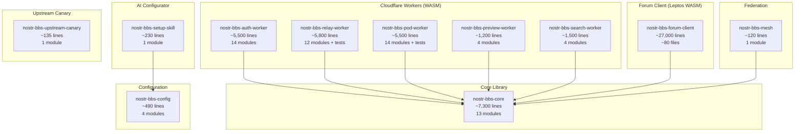
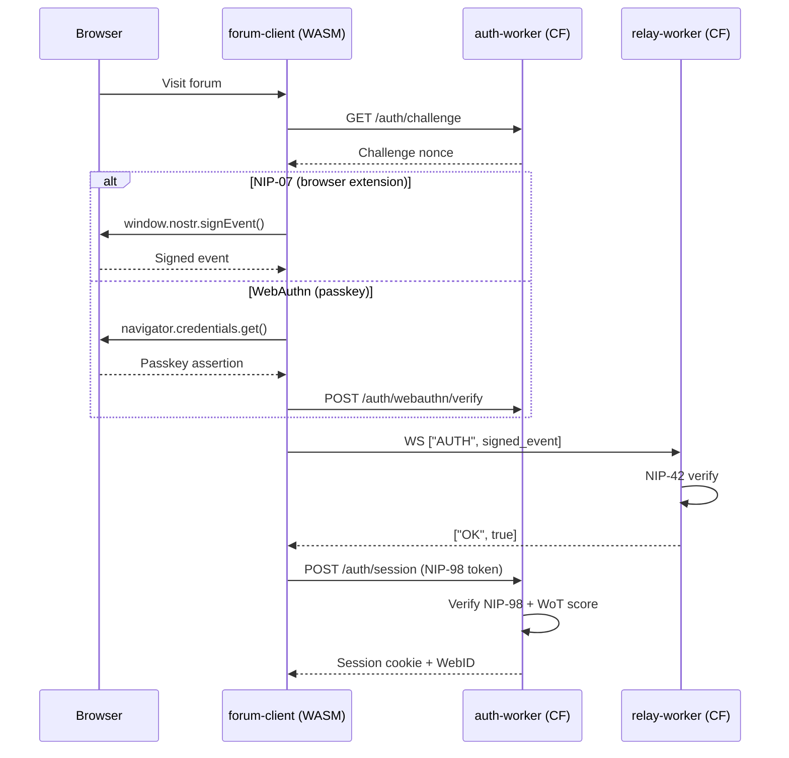
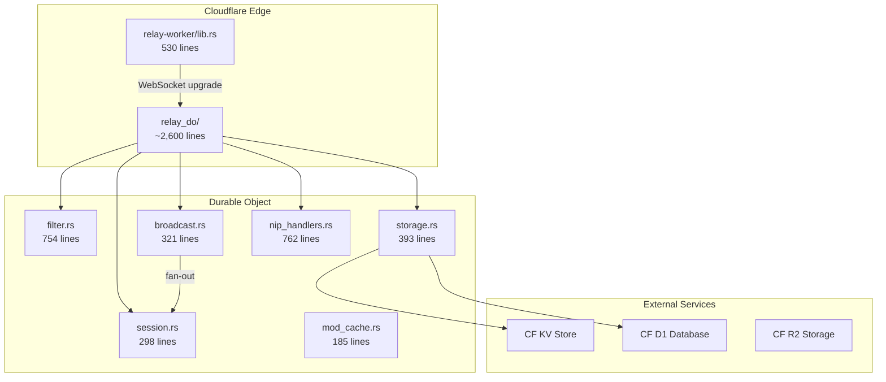

# nostr-rust-forum Architecture Map

> Generated: 2026-05-09 | Substrate: `/home/devuser/workspace/nostr-rust-forum/`
> Files: 125 (.rs) | Lines: 66,794 | Crates: 10

---

## 1. Workspace Crate Graph

## 2. Auth Flow Diagram

## 3. Relay Durable Object Architecture

## 4. File Checklist

### nostr-bbs-core (~7,300 lines)

| Status | File | Lines |
|--------|------|-------|
| [x] | src/nip98.rs | 1075 |
| [x] | src/nip90.rs | 610 |
| [x] | src/moderation_events.rs | 682 |
| [x] | src/gift_wrap.rs | 652 |
| [x] | src/event.rs | 604 |
| [x] | src/types.rs | 446 |
| [x] | src/groups.rs | 441 |
| [x] | src/nip04.rs | 435 |
| [x] | src/calendar.rs | 382 |
| [x] | src/nip26.rs | 372 |
| [x] | src/keys.rs | 369 |
| [x] | src/nip19.rs | 343 |
| [x] | src/signer.rs | 339 |
| [x] | src/nip44.rs | 317 |
| [x] | src/deletion.rs | 183 |
| [x] | src/wasm_bridge.rs | 241 |
| [x] | src/lib.rs | 73 |

### nostr-bbs-auth-worker (~5,500 lines)

| Status | File | Lines |
|--------|------|-------|
| [x] | src/webauthn.rs | 1467 |
| [x] | src/moderation.rs | 812 |
| [x] | src/invites.rs | 798 |
| [x] | src/welcome.rs | 590 |
| [x] | src/wot.rs | 554 |
| [x] | src/lib.rs | 551 |
| [x] | src/username.rs | 524 |
| [x] | src/admins.rs | 290 |
| [x] | src/delegation.rs | 288 |
| [x] | src/crypto.rs | 222 |
| [x] | src/schema.rs | 207 |
| [x] | src/admin.rs | 167 |
| [x] | src/auth.rs | 140 |
| [x] | src/pod.rs | 138 |
| [x] | src/http.rs | 43 |
| [x] | src/rate_limit.rs | 46 |

### nostr-bbs-relay-worker (~5,800 lines)

| Status | File | Lines |
|--------|------|-------|
| [x] | src/relay_do/filter.rs | 754 |
| [x] | src/relay_do/nip_handlers.rs | 762 |
| [x] | src/trust.rs | 741 |
| [x] | src/whitelist.rs | 546 |
| [x] | src/lib.rs | 530 |
| [x] | src/relay_do/storage.rs | 393 |
| [x] | src/cron.rs | 387 |
| [x] | src/moderation.rs | 383 |
| [x] | src/relay_do/broadcast.rs | 321 |
| [x] | src/relay_do/session.rs | 298 |
| [x] | src/relay_do/mod.rs | 284 |
| [x] | src/profiles.rs | 251 |
| [x] | src/audit.rs | 204 |
| [x] | src/relay_do/mod_cache.rs | 185 |
| [x] | src/auth.rs | 167 |
| [x] | src/nip11.rs | 53 |

### nostr-bbs-forum-client (~27,000 lines)

| Status | Module | Files | Lines |
|--------|--------|-------|-------|
| [x] | pages/ (16 files) | 16 | ~6,400 |
| [x] | components/ (47 files) | 47 | ~8,800 |
| [x] | admin/ (10 files) | 10 | ~4,600 |
| [x] | auth/ (6 files) | 6 | ~2,600 |
| [x] | stores/ (9 files) | 9 | ~2,400 |
| [x] | dm/ (2 files) | 2 | ~760 |
| [x] | utils/ (6 files) | 6 | ~920 |
| [x] | app.rs | 1 | 916 |
| [x] | relay.rs | 1 | 546 |
| [x] | main.rs | 1 | 99 |

### nostr-bbs-pod-worker (~5,500 lines)

| Status | File | Lines |
|--------|------|-------|
| [x] | src/lib.rs | 1409 |
| [x] | src/acl.rs | 600 |
| [x] | src/provision.rs | 425 |
| [x] | src/did.rs | 315 |
| [x] | src/patch.rs | 319 |
| [x] | src/payments.rs | 307 |
| [x] | src/content_negotiation.rs | 243 |
| [x] | src/remote_storage.rs | 197 |
| [x] | src/notifications.rs | 167 |
| [x] | src/container.rs | 162 |
| [x] | src/auth.rs | 123 |
| [x] | src/conditional.rs | 110 |
| [x] | src/quota.rs | 107 |
| [x] | src/storage/cf_backend.rs | 97 |
| [x] | src/contexts.rs | 80 |
| [x] | src/webid.rs | 38 |

---

## 5. PARALLEL Implementations

### P1: Rate Limiting (3 identical stubs)

| Location | Lines |
|----------|-------|
| `nostr-bbs-auth-worker/src/rate_limit.rs` | 46 |
| `nostr-bbs-preview-worker/src/rate_limit.rs` | 46 |
| `nostr-bbs-search-worker/src/rate_limit.rs` | 46 |

All three are identical token-bucket stubs. Should be extracted to a shared crate.

### P2: Auth/NIP-98 Verification (3 locations)

| Location | Purpose |
|----------|---------|
| `nostr-bbs-core/src/nip98.rs` (1075 lines) | Core NIP-98 implementation |
| `nostr-bbs-auth-worker/src/auth.rs` (140 lines) | Worker-specific auth wrapper |
| `nostr-bbs-search-worker/src/auth.rs` (145 lines) | Search worker auth wrapper |

### P3: Moderation (2 implementations)

| Location | Lines |
|----------|-------|
| `nostr-bbs-auth-worker/src/moderation.rs` | 812 |
| `nostr-bbs-relay-worker/src/moderation.rs` | 383 |

Both implement moderation logic from different angles (auth-side vs relay-side).

---

## 6. ISOLATED Code

| Location | Evidence |
|----------|----------|
| `nostr-bbs-mesh/src/lib.rs` (119 lines) | Mesh federation crate; mostly type definitions, no consumers |
| `nostr-bbs-setup-skill/src/lib.rs` (230 lines) | AI configurator skill; standalone, not wired to forum runtime |
| `nostr-bbs-upstream-canary/src/lib.rs` (135 lines) | Canary tests for upstream crate compatibility; CI-only |
| `forum-client/src/pages/search.rs` (16 lines) | Near-empty search page |
| `forum-client/src/pages/marketplace.rs` (150 lines) | Marketplace page; feature not yet live |

---

## 7. STUBS

| Location | Type | Description |
|----------|------|-------------|
| `nostr-bbs-setup-skill/src/lib.rs` | Has `todo!` | AI setup skill contains todo! markers |
| `nostr-bbs-mesh/src/lib.rs` (119 lines) | Scaffold | Mesh federation types only, no protocol implementation |
| `forum-client/src/pages/search.rs` (16 lines) | Stub | 16-line search page with no implementation |
| `forum-client/src/utils/solid.rs` (46 lines) | Thin | Minimal Solid pod client utility |
