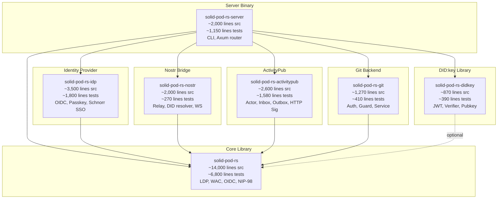
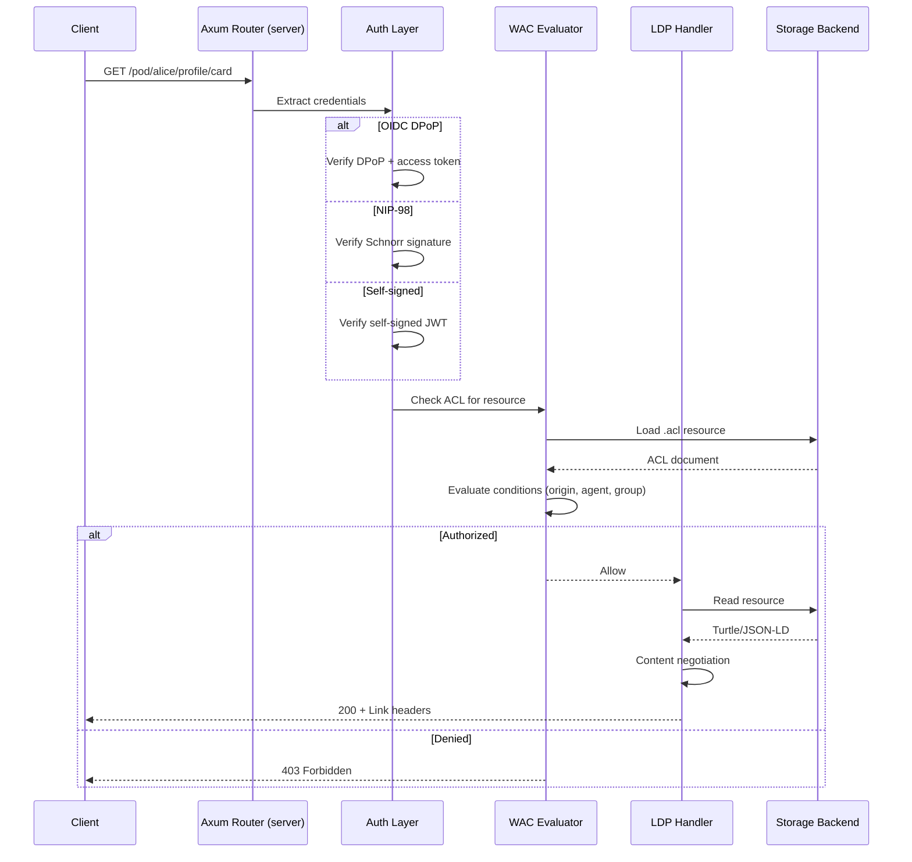
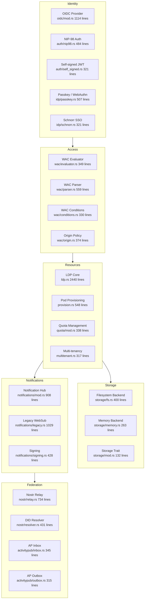

# solid-pod-rs Architecture Map

> Generated: 2026-05-09 | Substrate: `/home/devuser/workspace/solid-pod-rs/`
> Files: 100 (.rs) | Lines: 49,041 | Crates: 7

---

## 1. Workspace Crate Graph

## 2. Request Processing Pipeline

## 3. Data Flow Diagram

## 4. File Checklist

### solid-pod-rs (core) -- Source: ~14,000 lines

| Status | File | Lines |
|--------|------|-------|
| [x] | src/ldp.rs | 2440 |
| [x] | src/oidc/mod.rs | 1114 |
| [x] | src/notifications/legacy.rs | 1029 |
| [x] | src/notifications/mod.rs | 908 |
| [x] | src/config/sources.rs | 699 |
| [x] | src/security/ssrf.rs | 784 |
| [x] | src/wac/parser.rs | 559 |
| [x] | src/provision.rs | 548 |
| [x] | src/interop.rs | 550 |
| [x] | src/mashlib.rs | 506 |
| [x] | src/auth/nip98.rs | 484 |
| [x] | src/oidc/jwks.rs | 459 |
| [x] | src/security/dotfile.rs | 452 |
| [x] | src/oidc/replay.rs | 446 |
| [x] | src/wac/mod.rs | 424 |
| [x] | src/notifications/signing.rs | 428 |
| [x] | src/storage/fs.rs | 400 |
| [x] | src/webid.rs | 391 |
| [x] | src/wac/origin.rs | 374 |
| [x] | src/security/cors.rs | 362 |
| [x] | src/security/rate_limit.rs | 352 |
| [x] | src/config/schema.rs | 350 |
| [x] | src/wac/evaluator.rs | 349 |
| [x] | src/wac/conditions.rs | 330 |
| [x] | src/config/loader.rs | 299 |
| [x] | src/auth/self_signed.rs | 321 |
| [x] | src/quota/mod.rs | 338 |
| [x] | src/multitenant.rs | 317 |
| [x] | src/storage/memory.rs | 263 |
| [x] | src/handlers/legacy_notifications.rs | 330 |
| [x] | src/lib.rs | 196 |
| [x] | src/storage/mod.rs | 132 |
| [x] | src/wac/resolver.rs | 106 |
| [x] | src/wac/serializer.rs | 107 |
| [x] | src/wac/document.rs | 109 |
| [x] | src/error.rs | 105 |
| [x] | src/metrics.rs | 96 |
| [x] | src/wac/client.rs | 84 |
| [x] | src/wac/issuer.rs | 72 |
| [x] | src/security/mod.rs | 71 |
| [x] | src/config/mod.rs | 57 |
| [x] | src/auth/mod.rs | 10 |
| [x] | src/handlers/mod.rs | 10 |

### solid-pod-rs (core) -- Tests: ~6,800 lines, 36 test files

| Status | File | Lines |
|--------|------|-------|
| [x] | tests/interop_jss.rs | 1029 |
| [x] | tests/wac_inheritance.rs | 740 |
| [x] | tests/wac2_conditions.rs | 403 |
| [x] | tests/oidc_dpop_signature.rs | 403 |
| [x] | tests/config_test.rs | 385 |
| [x] | tests/oidc_integration.rs | 340 |
| [x] | tests/oidc_mod_direct.rs | 342 |
| [x] | tests/server_routes_jss.rs | 338 |
| [x] | + 28 more test files | ~3,800 |

### solid-pod-rs-idp (~3,500 lines src + ~1,800 lines tests)

| Status | File | Lines |
|--------|------|-------|
| [x] | src/provider.rs | 801 |
| [x] | src/registration.rs | 561 |
| [x] | src/passkey.rs | 507 |
| [x] | src/credentials.rs | 417 |
| [x] | src/jwks.rs | 329 |
| [x] | src/schnorr.rs | 321 |
| [x] | src/session.rs | 244 |
| [x] | src/user_store.rs | 305 |
| [x] | src/tokens.rs | 188 |
| [x] | src/invites.rs | 182 |
| [x] | src/discovery.rs | 172 |
| [x] | src/axum_binder.rs | 141 |
| [x] | src/lib.rs | 104 |
| [x] | src/error.rs | 89 |

### solid-pod-rs-nostr (~2,000 lines src + ~270 lines tests)

| Status | File | Lines |
|--------|------|-------|
| [x] | src/relay.rs | 734 |
| [x] | src/resolver.rs | 431 |
| [x] | src/ws.rs | 364 |
| [x] | src/did.rs | 342 |
| [x] | src/lib.rs | 74 |
| [x] | src/error.rs | 59 |

### solid-pod-rs-activitypub (~2,600 lines src + ~1,580 lines tests)

| Status | File | Lines |
|--------|------|-------|
| [x] | src/store.rs | 708 |
| [x] | src/http_sig.rs | 563 |
| [x] | src/actor.rs | 364 |
| [x] | src/inbox.rs | 345 |
| [x] | src/delivery.rs | 334 |
| [x] | src/outbox.rs | 315 |
| [x] | src/discovery.rs | 121 |
| [x] | src/error.rs | 80 |
| [x] | src/lib.rs | 67 |

### solid-pod-rs-server, solid-pod-rs-didkey, solid-pod-rs-git

| Status | Crate | Src lines | Test lines |
|--------|-------|-----------|------------|
| [x] | solid-pod-rs-server | ~2,000 | ~1,150 |
| [x] | solid-pod-rs-didkey | ~870 | ~390 |
| [x] | solid-pod-rs-git | ~1,270 | ~410 |

---

## 5. PARALLEL Implementations

### P1: Auth Verification (3 paths, correctly separated)

| Location | Protocol |
|----------|----------|
| `src/auth/nip98.rs` (484 lines) | Nostr NIP-98 HTTP Auth |
| `src/auth/self_signed.rs` (321 lines) | Self-signed JWT |
| `src/oidc/mod.rs` (1114 lines) | OIDC DPoP bearer tokens |

These are correctly separated by protocol but share no common trait interface. Could benefit from a unified `AuthVerifier` trait.

### P2: Notifications (2 systems)

| Location | Lines |
|----------|-------|
| `src/notifications/mod.rs` | 908 |
| `src/notifications/legacy.rs` | 1029 |

Legacy WebSub notifications coexist with the newer notification system. Both are active.

### P3: WAC + OIDC JWKS Caching (2 JWKS implementations)

| Location | Lines |
|----------|-------|
| `src/oidc/jwks.rs` | 459 |
| `crates/solid-pod-rs-idp/src/jwks.rs` | 329 |

Both implement JWKS parsing/caching but for different consumers (core verifier vs IDP issuer).

---

## 6. ISOLATED Code

| Location | Evidence |
|----------|----------|
| `src/mashlib.rs` (506 lines) | Mashlib (NSS-compatible UI) serving; likely legacy |
| `src/handlers/legacy_notifications.rs` (330 lines) | Legacy notification handler route |
| `tests/parity_sprint12.rs` (92 lines) | Sprint-specific parity test; may be outdated |
| 5 benches files (675 lines total) | Benchmarks that may not run in CI |

---

## 7. STUBS

No `todo!` or `unimplemented!` macros found in the solid-pod-rs codebase. This is the cleanest substrate.

The only placeholder-adjacent pattern is the test fixture scaffolding in `tests/upstream_vectors/` which are L1 reference-vector test stubs from the mega-sprint Phase 1.
