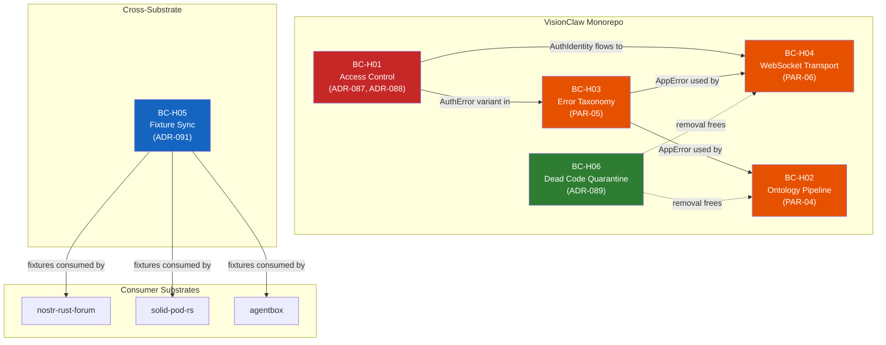

# DDD — Code Hygiene Remediation Bounded Context Map

| Field | Value |
|-------|-------|
| Status | Draft (2026-05-09) |
| Drives | PRD-015 (ecosystem code hygiene) |
| Companion ADRs | ADR-087 (rate limit), ADR-088 (auth extraction), ADR-089 (CQRS removal), ADR-090 (math utils), ADR-091 (fixture sync) |
| Sibling DDDs | `ddd-mesh-federation-context.md`, `ddd-agentbox-integration-context.md` |

## Purpose

This document maps the bounded contexts affected by PRD-015's code hygiene remediation. Where `ddd-mesh-federation-context.md` maps the *federation wire boundaries*, this map focuses on the *internal structural boundaries* where parallel implementations, dead code, and cross-cutting concerns create friction.

The remediation touches 6 bounded contexts across 4 substrates. The core insight is that most parallelism arose because contexts grew their own infrastructure (auth, rate limiting, error handling) instead of consuming shared services at well-defined boundaries.

---

## Bounded Contexts Affected

### BC-HYGIENE-01 — Access Control Context (VisionClaw)

**Owner**: VisionClaw backend team.

**Problem**: 6 auth modules (2,349 lines) with no shared trait, inconsistent error shapes, and a bypass env var (`SETTINGS_AUTH_BYPASS`).

**Aggregates** (post-remediation per ADR-088):

- **`AuthIdentity`**: Union type — `Nostr { pubkey, delegation }`, `Enterprise { subject, claims }`, `Anonymous`. Minted by `AuthMiddleware` at request boundary; propagated via Actix request extensions.
- **`AuthSession`**: Per-connection state for WebSocket upgrade auth. Created during WS handshake, bound to connection lifetime.
- **`RateLimitBucket`**: Per-key token bucket (per ADR-087). Keyed by `(scope, identity_or_ip)`.

**Invariants** (BC-H01-Inv):

- **H01-Inv-01**: Every HTTP request except health-check passes through `AuthMiddleware`. No handler directly reads auth headers.
- **H01-Inv-02**: `SETTINGS_AUTH_BYPASS` does not exist. Dev-mode anonymous access is controlled by `APP_ENV=development` + localhost origin check inside `CompositeAuthService`.
- **H01-Inv-03**: Rate limit configuration is per-scope, defined in one location (`RateLimitConfig`). No handler implements its own rate counter.
- **H01-Inv-04**: Auth errors produce a single `AuthError` type that maps to HTTP 401/403 consistently.

**Anti-corruption layer**:

- `AuthMiddleware` is the ACL between external HTTP/WS requests and the actor mailbox system. It translates wire-level credentials (NIP-98 token, Bearer JWT, WS challenge) into `AuthIdentity` domain objects.

---

### BC-HYGIENE-02 — Ontology Processing Context (VisionClaw)

**Owner**: VisionClaw backend team.

**Problem**: 7 ontology-related modules (~3,700 lines) with overlapping responsibilities: two `owl_validator.rs` files, three reasoning services, one pipeline service, one enrichment service. (PRD-015 PAR-04)

**Aggregates** (post-remediation):

- **`OntologyPipeline`**: Orchestrates validate → reason → enrich → persist. Single entry point replacing 4 separate invocation paths.
- **`OwlValidation`**: Validates OWL/RDF input against structural rules. Consumes raw triples, produces `ValidationReport`.
- **`OntologyReasoning`**: Applies inference rules (RDFS subclass closure, custom DreamLab rules). Consumes validated triples, produces inferred triples.
- **`OntologyEnrichment`**: Adds derived properties (labels, cross-references). Final stage before persistence.

**Invariants** (BC-H02-Inv):

- **H02-Inv-01**: `OntologyPipeline` is the only entry point for ontology processing. No handler calls validator/reasoner/enricher directly.
- **H02-Inv-02**: Each pipeline stage is a pure function from `(input_triples, config) -> (output_triples, report)`. Side effects (Neo4j writes) happen only after the full pipeline completes.
- **H02-Inv-03**: The duplicate `services/owl_validator.rs` is deleted; `ontology/services/owl_validator.rs` is canonical.

**Boundary**: The `OntologyPipeline` aggregate is consumed by `OntologyGuidanceActor` (BC13/BC19) and by the GitHub sync ingest path. Both go through the same pipeline.

---

### BC-HYGIENE-03 — Error Taxonomy Context (VisionClaw)

**Owner**: VisionClaw backend team.

**Problem**: 4 error modules (~2,200 lines) with different `From` impl chains, inconsistent HTTP status mapping, and two separate `ApiError` types. (PRD-015 PAR-05)

**Aggregates** (post-remediation):

- **`AppError`**: Single top-level error enum using `thiserror::Error` derive. Variants:
  - `Auth(AuthError)` — 401/403
  - `Validation(ValidationError)` — 400
  - `NotFound(String)` — 404
  - `RateLimit(RateLimitError)` — 429
  - `Service(ServiceError)` — 500/502/503
  - `Domain(DomainError)` — 409/422

**Invariants** (BC-H03-Inv):

- **H03-Inv-01**: Every handler returns `Result<HttpResponse, AppError>`. No handler constructs `HttpResponse::InternalServerError()` directly.
- **H03-Inv-02**: `impl ResponseError for AppError` provides the single HTTP status mapping. No parallel `From<Error> for HttpResponse` implementations exist.
- **H03-Inv-03**: `utils/validation/errors.rs` and `utils/result_helpers.rs` are deleted. `errors/mod.rs` is the single source.

---

### BC-HYGIENE-04 — WebSocket Transport Context (VisionClaw)

**Owner**: VisionClaw backend team.

**Problem**: 3 WebSocket handler implementations (~4,300 lines) — `socket_flow_handler/`, `fastwebsockets_handler.rs`, and `multi_mcp_websocket_handler.rs`. (PRD-015 PAR-06)

**Aggregates** (post-remediation):

- **`WsConnection`**: Unified WebSocket connection manager. Protocol-multiplexes between binary position streams, JSON control messages, and MCP tool invocations.
- **`WsProtocol`**: Enum discriminator — `Binary` (GPU positions, per `docs/binary-protocol.md`), `JsonControl` (settings, auth, subscriptions), `McpRelay` (tool invoke/result).

**Invariants** (BC-H04-Inv):

- **H04-Inv-01**: Single WS upgrade path in `main.rs`. Protocol detection happens after upgrade, not before.
- **H04-Inv-02**: `fastwebsockets_handler.rs` handles the performance-critical binary path. The legacy `socket_flow_handler/` JSON path is folded into `WsConnection`.
- **H04-Inv-03**: `multi_mcp_websocket_handler.rs` becomes a `McpRelay` variant inside `WsConnection`, not a separate handler.

---

### BC-HYGIENE-05 — Cross-Substrate Fixture Context (all substrates)

**Owner**: VisionClaw as master; consumers own their sync scripts.

**Problem**: Fixtures never synced despite infrastructure being in place. (QE W5 finding, ADR-091)

**Aggregates**:

- **`FixtureMaster`**: The 13 JSON fixture files at `docs/specs/fixtures/`. Includes checksums, schemas, and upstream pin references.
- **`ConsumerManifest`**: Per-substrate `tests/fixtures/MANIFEST.txt` listing which fixtures that substrate consumes.
- **`SyncScript`**: Per-substrate `scripts/sync-fixtures.sh` implementing the copy + verify protocol.

**Invariants** (BC-H05-Inv):

- **H05-Inv-01**: `CHECKSUMS.txt` is updated every time a fixture changes in the master.
- **H05-Inv-02**: Consumer CI runs `sync-fixtures.sh --verify` and fails on drift.
- **H05-Inv-03**: Consumer `MANIFEST.txt` is the explicit opt-in list. Consumers don't blindly copy all 13 fixtures.
- **H05-Inv-04**: No consumer modifies fixtures locally. Fixtures are read-only copies of the master.

---

### BC-HYGIENE-06 — Dead Code Quarantine (VisionClaw)

**Owner**: VisionClaw backend + client teams.

**Problem**: ~6,200 lines of dead code across 2 substrates. Some is truly dead (CQRS bus), some is unused-but-planned (Contributor Studio stubs), some is speculative (graph innovations).

**Policy** (post-remediation per ADR-089):

- **Truly dead**: Delete. CQRS bus (3,200 lines), `aiInsights.ts` (1,109), `advancedInteractionModes.ts` (862), `graphComparison.ts` (677), `gnnPhysics.ts` (386), `graphSynchronization.ts` (276), `innovations/index.ts` (410), root-level `analyticsStore.ts` (151), root-level `BrokerInbox.tsx` (458).
- **Stubs with roadmap**: Keep but tag with `#[cfg(feature = "contributor-studio")]` / `#[cfg(feature = "mcp-tools")]`. Prevents compilation in production builds; preserves intent.
- **`#[allow(dead_code)]` annotations**: Remove. If the code compiles without the annotation, it's used. If it doesn't, it's dead — delete it.

---

## Context Map (Mermaid)

---

## Remediation Sequence

The context map implies a dependency order for remediation:

1. **BC-H06** (dead code quarantine) — Remove CQRS bus + client dead code first. This reduces noise for subsequent refactors.
2. **BC-H03** (error taxonomy) — Unify error types. Required before auth extraction because `AuthError` must be a variant of the unified `AppError`.
3. **BC-H01** (access control) — Extract `AuthService` trait + consolidate rate limiting. Depends on unified error types.
4. **BC-H02** (ontology pipeline) — Collapse 7 modules into pipeline. Uses unified errors.
5. **BC-H04** (WebSocket transport) — Consolidate handlers. Uses unified auth + errors.
6. **BC-H05** (fixture sync) — Independent; can run in parallel with steps 1-5.

This maps to PRD-015's 4-sprint plan:
- Sprint 1: BC-H06 + BC-H05 + quick wins (PAR-07, PAR-08, PAR-10)
- Sprint 2: BC-H03 + BC-H01
- Sprint 3: BC-H02 + cross-substrate convergence (O1, O4)
- Sprint 4: BC-H04 + stub completion
