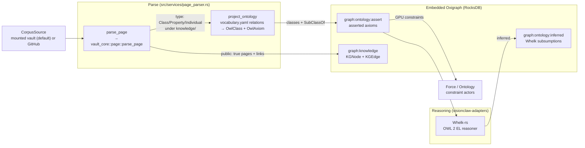
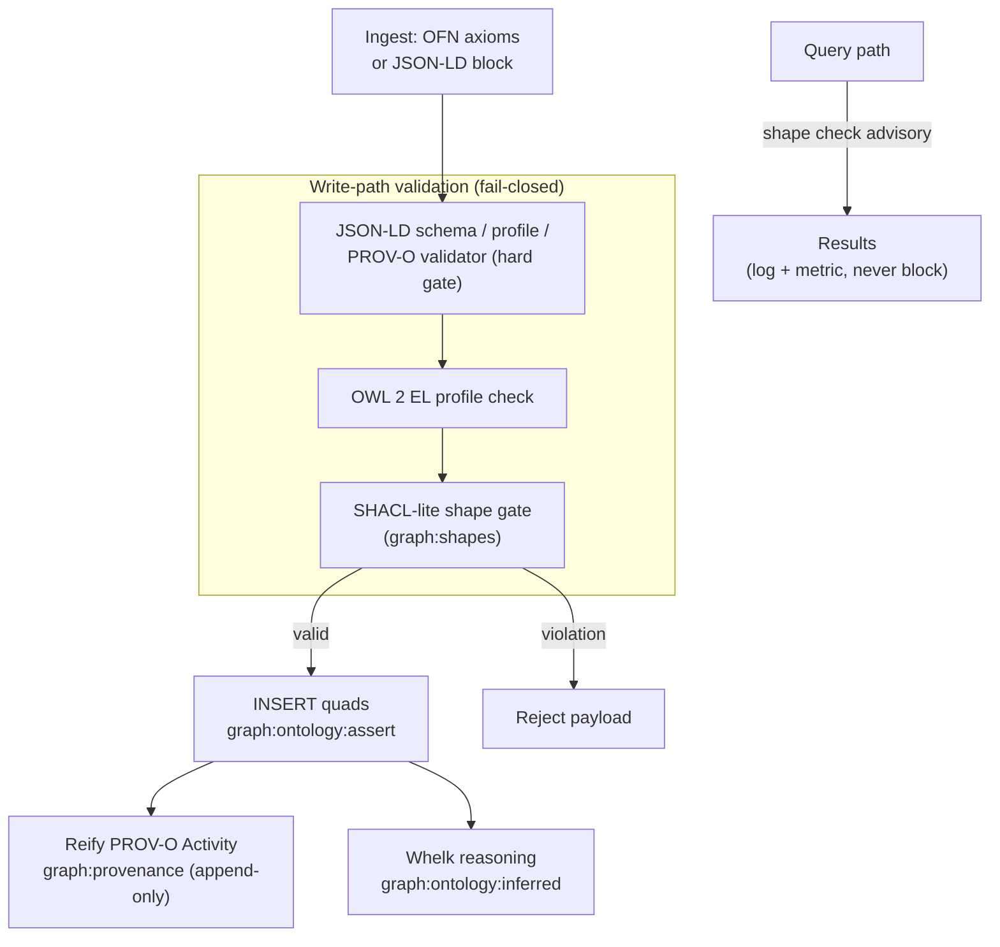

# Ontology Pipeline

> [VisionClaw Docs](../README.md) · [Explanation](README.md)

VisionClaw maintains a formal OWL 2 ontology alongside its display knowledge graph. The pipeline ingests vault Markdown (Obsidian frontmatter, see [`VAULT-corpus-format.md`](../VAULT-corpus-format.md)) from a GitHub repository, extracts OWL axioms, reasons over them with a native Rust EL reasoner, stores everything as RDF in an embedded triple store, and validates and signs each contribution. This document explains the stages, the data contracts between them, and where each lives in the `visionclaw-ontology` and `visionclaw-adapters` crates.

The graph store is an **embedded Oxigraph** RDF quad-store (in-process, RocksDB-backed, W3C SPARQL 1.1). It is the sole store for both knowledge-graph and ontology data under the persistence migration (ADR-2004), implemented by the triple-store migration framework (ADR-101). Neo4j is fully removed: there is no Bolt URI, no `NEO4J_*` configuration, and no separate database-browser UI. User settings persist in an embedded SQLite store.

---

## 1. Pipeline at a glance

The corpus is frontmatter-only (ADR-2112): a page's ontology identity is its OKF `type`, `resource`, `title` and `slug` properties, and its relations are the list-of-wikilink keys that `ontology/vocabulary.yaml` declares. Every page is parsed once, by the same parser `vault build` uses (`vault_core::page::parse_page`, ADR-2113), so the graph and the published ontology read the corpus through one implementation. Neither `key:: value` lines nor `json-ld` fences carry meaning.



The SHACL-lite gate (`visionclaw_ontology::services::jsonld_ingest::shacl_gate`) remains on the governed write door; it does not read the corpus. All writers share the Oxigraph store, the trust layer (Section 5), and the query surface (Section 7).

---

## 2. Stage 1 — corpus ingestion

`GitHubSyncService::sync_graphs()` (`src/services/github_sync_service.rs`; the type keeps its historical name) is the entry point. It lists pages through the `CorpusSource` port — a mounted vault directory by default, the GitHub repository when selected (ADR-2114) — under `VAULT_BASE_PATHS` (local; `GITHUB_BASE_PATHS` for GitHub; default `knowledge/pages,working/pages`), in batches, and skips unchanged pages by the source's change marker. `FORCE_FULL_SYNC=1` bypasses the incremental filter and reprocesses every file; reset it to `0` afterwards.

Each page is parsed once by `page_parser::parse_page`. A page whose frontmatter carries `public: true` becomes a knowledge-graph page node and its links (the curated `links` list, else the body's wikilinks) become edges in `urn:ngm:graph:knowledge`. A page without frontmatter is private, fail-closed. **Independently of the publish gate**, a page under `knowledge/` whose `type` is `Class`, `Property` or `Individual` is an ontology page, so private ontology pages still contribute axioms.

---

## 3. Stage 2 — OWL projection

`page_parser::project_ontology` turns the ontology pages into an `OntologyProjection` — one `OwlClass` per page, keyed by its `resource`, plus the asserted axioms — through the vocabulary. A relation target resolves to the `resource` of the page it names (by page id, title or slug, case-insensitively), otherwise to `namespace + slug(target)`, the same long-tail IRI `vault build` mints. The taxonomy relation (the key whose property is `rdfs:subClassOf`) fills `parent_classes` and yields the `SubClassOf` axioms; the other vocabulary relations fill the class's relationship lists. The projection is loaded into `urn:ngm:graph:ontology:assert` (`load_ontology`, ADR-2064), rebuilt from the corpus on each full sync.

> The published ontology (`ontology.ttl`) is emitted by `vault build` (`crates/vault/src/build/turtle.rs`) from the same parsed pages; the two projections agree by construction.

---

## 4. Stage 3 — Whelk-rs OWL 2 EL reasoning

`WhelkInferenceEngine` (`crates/visionclaw-adapters/src/whelk_inference_engine.rs`) implements the `InferenceEngine` port using `horned-owl` for ontology construction and `whelk-rs` for EL classification. Whelk is the primary reasoner posture (ADR-099): a native Rust OWL 2 EL reasoner with no JVM dependency.

`load_ontology(classes, axioms)` builds a `SetOntology<ArcStr>`. Each domain `OwlAxiom` is mapped to a horned-owl component:

| Axiom type | horned-owl component | Notes |
|------------|----------------------|-------|
| `SubClassOf` | `SubClassOf` | directed subsumption |
| `EquivalentClass` | `EquivalentClasses` | native — Whelk derives both directions (ADR-099 D2) |
| `DisjointWith` | `DisjointClasses` | EL-derivable; collapse to `owl:Nothing` surfaces inconsistency (ADR-099 D3) |
| `SubPropertyOf` | `SubObjectPropertyOf` | role hierarchy |
| `TransitiveProperty` / `SymmetricProperty` / `InverseProperties` | corresponding property axioms | |
| `SomeValuesFrom` | `SubClassOf(C, ObjectSomeValuesFrom(p, D))` | existential restriction |
| `ObjectPropertyAssertion` | (skipped for EL Tbox) | mereological/associative facts (`hasPart`, `partOf`, `sameAs`) drive GPU forces directly, not classification |

`infer()` calls `whelk::owl::translate_ontology` then `whelk::reasoner::assert`, and reads `named_subsumptions()`. `convert_subsumptions_to_axioms` returns the directed `SubClassOf` closure **plus** one canonical `EquivalentClass(A, B)` per bidirectional, non-reflexive, non-sentinel pair (`owl:Thing`/`owl:Nothing` are excluded). Equivalence therefore survives end-to-end rather than degrading to two opaque sub-class edges.

**Caching.** `compute_ontology_checksum` hashes the sorted axiom set (`DefaultHasher`). If the checksum is unchanged since the last load, `infer()` returns the cached subsumptions without re-running the classifier. **Consistency.** `check_consistency` reports `false` when any class other than `owl:Nothing` is inferred to be `⊑ owl:Nothing`. Results carry `reasoner_version: whelk-rs-<pkg-version>`.

Inferred axioms are materialised into `urn:ngm:graph:ontology:inferred`; the asserted axioms stay in `urn:ngm:graph:ontology:assert`. Asserted-vs-inferred provenance is preserved by graph membership, so a consumer can always tell what was stated from what was derived.

---

## 5. Stage 4 — Oxigraph storage and the trust layer

`OxigraphOntologyRepository` (`crates/visionclaw-adapters/src/oxigraph_ontology_repository.rs`) serialises classes, properties, axioms, nodes, and edges into RDF quads across a fixed family of named graphs.

### Named graphs

| Named graph IRI | Contents |
|-----------------|----------|
| `urn:ngm:graph:ontology:assert` | asserted OWL classes, properties, axioms |
| `urn:ngm:graph:ontology:inferred` | Whelk-derived subsumptions (Section 4) |
| `urn:ngm:graph:knowledge` | `KGNode` + `KGEdge` display triples |
| `urn:ngm:graph:agent` | agent-scoped triples |
| `urn:ngm:graph:shapes` | W3C SHACL `NodeShape` triples loaded from `.ttl` at startup (PRD-022) |
| `urn:ngm:graph:provenance` | append-only PROV-O activity triples (PRD-022) |
| `urn:ngm:graph:ontology:summary` / `:observed` | approval-driven write-back and observed facts (the only graphs the fenced derived path may write) |
| `urn:ngm:graph:cache:sssp` / `:apsp` | pathfinding caches (own sub-domain so `CLEAR GRAPH` invalidates atomically) |
| `urn:ngm:graph:migrations` | migration ledger (ADR-101) |
| (default graph) | cross-graph bridges + schema |

### IRI minting

All IRIs use the `vc:` prefix expanding to `https://narrativegoldmine.com/ns/v1#`. Classes mint `urn:ngm:class:<slug>`, properties `urn:ngm:property:<slug>`, and axioms `urn:ngm:axiom:<sha256-12>` (content-addressed, so identical axioms deduplicate). The `:assert` and `:inferred` graphs are fenced from the derived write path; the migration framework records each applied SPARQL migration in the ledger graph exactly once.

### Validation and provenance



**SHACL-lite + JSON-LD validation.** On the write path, the JSON-LD validator (schema, profile, and PROV-O attribution checks) is a hard gate — a failure rejects the payload. The SHACL-lite shape gate (`jsonld_ingest/shacl_gate.rs`, `jsonld_validator/shacl_lite.rs`) then checks every parsed shape against the shapes graph. Shape gating is **fail-closed on writes** (a violation on ingest rejects) and **fail-open on reads** (a violation on a consumer query is advisory: logged and metered, never blocking). The OWL 2 EL profile validator (`jsonld_validator/owl_el_profile.rs`) flags constructs outside EL (universal quantification, cardinality, disjunction) before they reach the reasoner.

**PROV-O provenance (PRD-022).** `provenance_emitter::reify_activity` writes each contribution as PROV-O triples into the append-only provenance graph (`INSERT DATA` only — no `DELETE`/`DROP`/`CLEAR`):

```turtle
<urn:visionclaw:execution:sha256-12-…> a prov:Activity ;
    prov:wasAssociatedWith <did:nostr:{hex-pubkey}> ;
    prov:startedAtTime "{iso8601}"^^xsd:dateTime ;
    prov:used <{source-iri}> ;        # optional
    prov:generated <{output-urn}> ;   # optional
    prov:wasInformedBy <{prior-urn}> ; # optional, causal chain
    vc:action "{verb}" ;              # propose | infer | ingest | enrich
    vc:derivation "{asserted|inferred|proposed}" .
```

Each record is 5–8 triples. The provenance graph does not participate in Whelk reasoning and is not covered by ontology forces — it is a pure audit trail, queryable per agent DID.

---

## 6. Stage 5 — GPU constraint application

Axioms in the asserted graph become physics constraints. `SubClassOf` clusters children near parents, `EquivalentClass` aligns/colocates, and `DisjointWith` separates. Mereological object-property assertions (`hasPart`, `partOf`) drive forces directly without classification (Section 4). The `OntologyConstraintActor` translates axioms into 64-byte-aligned GPU constraint records, which the `ForceComputeActor` re-applies each physics frame. The constraint formats, CUDA kernels, priority blending, and `SemanticPhysicsConfig` parameters are documented in [Physics & GPU Engine](physics-gpu-engine.md).

---

## 7. Query surface — MCP tools and read-only SPARQL

Agents reason over the ontology through **7 MCP ontology tools** (`crates/visionclaw-ontology/src/types/ontology_tools.rs`):

| Tool | Purpose |
|------|---------|
| `ontology_discover` | semantic class discovery via hierarchy + Whelk inference |
| `ontology_read` | read a note with full ontology context and inferred axioms |
| `ontology_query` | validated read-only graph query |
| `ontology_traverse` | walk the ontology graph from a start IRI to a depth |
| `ontology_propose` | propose a new note or amendment (staged → PR) |
| `ontology_validate` | check candidate axioms for Whelk consistency |
| `ontology_status` | reasoner / store health and statistics |

SPARQL reaches the store through a fenced read path. `clamp_select_limit` injects or clamps a top-level `LIMIT` (default and hard cap 10,000 rows); serialisation enforces an 8 MB byte ceiling; `validate_read_only_sparql` rejects mutations; and the SPARQL `SERVICE` keyword is blocked at the handler boundary to prevent SSRF and data exfiltration (auth enforcement, ADR-011). The legacy Cypher endpoint was removed in the Oxigraph migration; tool inputs that still carry a `cypher` field resolve against Oxigraph via SPARQL for backward compatibility.

The pervasive ontology binding (ADR-112, `ontology_ask`) layers a budget-bounded, provenance-scoped retrieval over this surface — read-pervasive and write-governed, fail-open so it never blocks a turn. See the [MCP tools reference](../reference/mcp-tools.md).

---

## 8. Crate layout and actor wiring

The ontology subsystem is the `visionclaw-ontology` crate, extracted under the hexagonal modularisation (ADR-090 Phase A4). It is one of eight workspace crates — `visionclaw-{contracts, domain, protocol, adapters, gpu, ontology, actors, xr-presence}` — and sits at the tail of the dependency DAG: `contracts → domain → adapters → ontology`.

| Module | Responsibility |
|--------|----------------|
| `inference` | OWL 2 EL++ parser, inference cache, optimisation |
| `reasoning` | custom Whelk-backed reasoner |
| `ontology` | actor and physics modules, OWL validator service (page parsing moved to `vault_core`, ADR-2113) |
| `services/jsonld_ingest` | extractor → expander → validator → SHACL gate → triple emitter |
| `services/jsonld_validator` | EL profile, SHACL-lite, IRI/class checks |
| `validation`, `types`, `utils` | actor-state validation, MCP tool surface, time helpers |

Services that need actors, GPU, or config stay in the `webxr` crate: the ontology query, mutation, pipeline, enrichment, reasoner, and schema services.

The `OntologyActor` (`src/actors/ontology_actor.rs`) handles **validation and coordination** — OWL validation via `OwlValidatorService`, a priority job queue (`Critical`/`High`/`Normal`/`Low`), TTL report caching, and propagation to the `PhysicsOrchestratorActor` (constraints) and `SemanticProcessorActor` (inference). Classification inference itself is owned by the `ReasoningActor`, not the `OntologyActor`.

---

## 9. Cross-pack — agentbox elevation bridge

VisionClaw is the **host** ontology platform: it ingests, reasons, validates, and stores. The agentbox subsystem is where personal-pod knowledge graphs are **elevated** into this shared ontology. An agent grows a private knowledge graph on its Solid pod, and selected concepts are promoted into VisionClaw's shared ontology behind a Whelk consistency gate and ACSP approval, with PROV-O provenance crossing the federation boundary. VisionClaw links into that subsystem; it never duplicates it. See the agentbox [ecosystem](../../agentbox/docs/developer/ecosystem.md) developer guide for the elevation path and the BC20 anti-corruption mapping between the `urn:visionclaw:*` and `urn:agentbox:*` namespaces.

---

## See also

- [DDD: Semantic Pipeline — Bounded Contexts](ddd-semantic-pipeline.md) — the domain model and edge-type contracts feeding this pipeline
- [Physics & GPU Engine](physics-gpu-engine.md) — how asserted axioms become constraint forces
- [Bounded Contexts](bounded-contexts.md) — where the ontology context sits in the system
- [MCP Tools reference](../reference/mcp-tools.md) · [Graph Schema reference](../reference/graph-schema.md)
- agentbox [ecosystem](../../agentbox/docs/developer/ecosystem.md) — the KG-elevation bridge subsystem
- Governing decisions: [ADR-101 — Triple-Store Migration Framework (Oxigraph, the ADR-2004 persistence migration)](../archive/adr/ADR-101-triple-store-migration-framework.md), [ADR-099 — Whelk EL Reasoner Posture](../archive/adr/ADR-099-reasoner-posture-whelk-el-primary.md), [ADR-014 — Semantic Pipeline Unification](../archive/adr/ADR-014-semantic-pipeline-unification.md), [ADR-090 — Hexagonal Crate Modularisation](../archive/adr/ADR-090-hexagonal-crate-modularisation.md), [ADR-127 — Semantic Trust Layer](../archive/adr/ADR-127-semantic-trust-layer.md), [ADR-011 — Auth Enforcement (SPARQL SERVICE fence)](../archive/adr/ADR-011-auth-enforcement.md), [PRD-022 — Semantic Trust Layer](../archive/prd/PRD-022-semantic-trust-layer.md)
</content>
</invoke>
