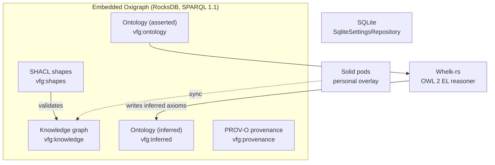

# Graph Schema Reference

> [VisionClaw Docs](../README.md) · [Reference](README.md)

VisionClaw stores its graph as RDF in an **embedded Oxigraph** triple store: in-process,
RocksDB-backed, exposing W3C **SPARQL 1.1 Query and Update** over the dataset at
`${DATA_DIR}/oxigraph/`. There is no external database server, no Bolt port, and no Cypher
engine. User settings persist separately in **SQLite** (`SqliteSettingsRepository`); they are
not triples. Per [ADR-132](../archive/adr/ADR-132-neo4j-removal-oxigraph-adoption.md), Oxigraph is the sole primary
graph store — any reference to Neo4j, Cypher, or a graph database browser describes a
historical state that has been removed.

The model below is the **logical schema**. Oxigraph maintains the SPO/POS/OSP triple indexes
automatically, so the "constraints and indexes" of a labelled-property database become
data-shape contracts expressed as **SHACL shapes** and IRI uniqueness, not `CREATE INDEX`
statements.

---

## 1. Store layout — named graphs

The dataset is partitioned into named graphs by concern. Each SPARQL query scopes itself with
a `GRAPH` block; queries that omit one read the union (default graph behaviour depends on the
service configuration).



| Named graph | IRI | Written by | Contents |
|-------------|-----|-----------|----------|
| Knowledge | `vfg:knowledge` | `GitHubSyncService` → `KnowledgeGraphParser` | Page, linked-page, and agent nodes plus their edges |
| Ontology (asserted) | `vfg:ontology` | `### OntologyBlock` parser + Horned-OWL importer | `owl:Class`, `owl:ObjectProperty`, asserted axioms |
| Ontology (inferred) | `vfg:inferred` | Whelk-rs OWL 2 EL reasoner | Derived `rdfs:subClassOf` and class-membership triples |
| Shapes | `vfg:shapes` | Ontology pipeline | SHACL-lite node/property shapes used for validation |
| Provenance | `vfg:provenance` | `BeadLifecycleOrchestrator` | PROV-O activities and Nostr-bead provenance (PRD-022) |

User settings, filters, and identity are **not** in the triple store — they live in SQLite and
are addressed by Nostr public key. See [Configuration](configuration.md).

---

## 2. Namespaces

```turtle
@prefix vf:      <https://visionclaw.io/ontology#> .   # VisionClaw schema vocabulary
@prefix vfg:     <https://visionclaw.io/graph/> .      # named-graph IRIs
@prefix vfn:     <https://visionclaw.io/node/> .       # node + edge instance IRIs
@prefix rdf:     <http://www.w3.org/1999/02/22-rdf-syntax-ns#> .
@prefix rdfs:    <http://www.w3.org/2000/01/rdf-schema#> .
@prefix owl:     <http://www.w3.org/2002/07/owl#> .
@prefix xsd:     <http://www.w3.org/2001/XMLSchema#> .
@prefix skos:    <http://www.w3.org/2004/02/skos/core#> .
@prefix prov:    <http://www.w3.org/ns/prov#> .
@prefix sh:      <http://www.w3.org/ns/shacl#> .
@prefix dcterms: <http://purl.org/dc/terms/> .
```

`vf:` is the VisionClaw schema vocabulary; `vfn:` mints stable instance IRIs (a node's
`metadata_id` UUID forms `vfn:n-{uuid}`). The same `vf:` namespace serialises into Solid
pods, so a node round-trips between the triple store and a user's pod without remapping.

---

## 3. Knowledge graph

Only vault pages whose YAML frontmatter carries `public: true` — or a non-empty `owl-class`,
which bypasses the publish gate — produce a page resource; the targets of their
`[[wikilink]]` references are materialised as linked-page resources even when the target file
lacks the gate. The Logseq property lines the bounded tolerance of
[ADR-2040](../adr/ADR-2040-obsidian-vault-frontmatter-gate.md) once accepted (`public:: true`,
`owl:class::`) are body text since ADR-2112 and carry no metadata; see
[`VAULT-corpus-format.md`](../VAULT-corpus-format.md) §V4. Agent and bot definitions enter the same graph as agent resources.

### 3a. Node types

`rdf:type` carries the structural class; the `vf:nodeType` literal preserves the parser's
original string for round-tripping.

| `rdf:type` | `vf:nodeType` | Origin |
|------------|---------------|--------|
| `vf:Page` | `"page"` | Vault page with `public: true` frontmatter (or an `owl-class`) |
| `vf:LinkedPage` | `"linked_page"` | Target of a `[[wikilink]]` from a public page |
| `vf:Agent` | `"agent"` | Agent definition node |
| `vf:Bot` | `"bot"` | Bot definition node |

`vf:Page`, `vf:LinkedPage`, `vf:Agent`, and `vf:Bot` are `rdfs:subClassOf vf:KnowledgeNode`.
Ontology-derived nodes (the client's `owl_*` types) are `owl:Class` / `owl:ObjectProperty`
resources in the ontology graph — see §5.

### 3b. Node shape

```turtle
vfn:n-3f2a8c10 a vf:Page ;
    vf:nodeId        42 ;                       # u32 — see §4
    vf:metadataId    "3f2a8c10-…" ;             # stable UUID
    rdfs:label       "Knowledge Graph" ;        # display title
    vf:nodeType      "page" ;
    vf:public        "true" ;                   # string, not xsd:boolean
    vf:content       "…raw markdown body…" ;
    vf:qualityScore  "0.82"^^xsd:float ;
    vf:clusterId     7 ;
    vf:posX          "12.5"^^xsd:float ;        # runtime physics state
    vf:posY          "-3.2"^^xsd:float ;
    vf:posZ          "0.8"^^xsd:float ;
    vf:velX          "0.0"^^xsd:float ;
    vf:velY          "0.0"^^xsd:float ;
    vf:velZ          "0.0"^^xsd:float ;
    dcterms:created  "2026-01-04T09:12:00Z"^^xsd:dateTime ;
    dcterms:modified "2026-06-20T11:03:00Z"^^xsd:dateTime ;
    # Sovereign-mesh fields (ADR-050, ADR-051)
    vf:visibility    "public" ;                 # "public" | "private"
    vf:ownerPubkey   "npub-hex…" ;              # required for private nodes
    vf:opaqueId      "a1b2c3…" ;                # 24 hex = HMAC of owner+IRI
    vf:podUrl        "/public/kg/knowledge-graph" .
```

### 3c. Predicate reference

| Predicate | Range | Notes |
|-----------|-------|-------|
| `vf:nodeId` | `xsd:integer` | u32 with type flag bits (§4); GPU buffer index |
| `vf:metadataId` | `xsd:string` | Stable UUID, cross-system reference |
| `rdfs:label` | `xsd:string` | Page title / display name |
| `vf:public` | `xsd:string` | `"true"` or `"false"` (string-encoded) |
| `vf:content` | `xsd:string` | Raw markdown body |
| `vf:qualityScore` | `xsd:float` | 0.0–1.0 |
| `vf:posX` / `vf:posY` / `vf:posZ` | `xsd:float` | Runtime layout position |
| `vf:velX` / `vf:velY` / `vf:velZ` | `xsd:float` | Runtime velocity (not always persisted) |
| `dcterms:created` / `dcterms:modified` | `xsd:dateTime` | Lifecycle timestamps |
| `vf:visibility` | `xsd:string` | `"public"` (default) or `"private"` |
| `vf:ownerPubkey` | `xsd:string` | Hex Nostr key; required when `vf:visibility = "private"` |
| `vf:opaqueId` | `xsd:string` | 24 hex chars, `HMAC-SHA256(daily_salt, ownerPubkey "|" iri)`; 48 h dual-salt rotation overlap |
| `vf:podUrl` | `xsd:anyURI` | Route in owner's Solid pod (`/public/kg/{slug}` or `/private/kg/{slug}`) |

Sovereign-mesh predicates are optional. Legacy nodes without `vf:visibility` are treated as
public by the `COALESCE` pattern in §7d, so new fields are backwards-compatible.

---

## 4. Node-ID flag-bit encoding

`vf:nodeId` is a 32-bit unsigned integer allocated by the global `NEXT_NODE_ID` atomic counter,
starting at 1. The low 26 bits hold the sequential identifier; the high bits encode the node
type as flags. The same integer indexes the node into the CUDA physics buffers, so the encoding
is read on the GPU via the per-node `class_id` / `class_charge` buffers for ontology constraint
forces — not for general rendering.

| Bits | Mask | Meaning |
|------|------|---------|
| 31 | `0x80000000` | Agent node |
| 30 | `0x40000000` | Knowledge / page node |
| 29 | `0x20000000` | Reserved (historical private-opacity flag; retired post-[ADR-061](../archive/adr/ADR-061-binary-protocol-unification.md)) |
| 28–26 | `0x1C000000` | Ontology subtype encoding (3 bits) |
| 25–0 | `0x03FFFFFF` | Sequential ID (`NODE_ID_MASK`), max 67,108,863 |

```
 31    30    29        28 27 26   25 ........................ 0
[AGT] [KNOW] [resv]   [ ontology ] [   sequential node id    ]
0x80.. 0x40.. 0x20..    0x1C....         0x03FFFFFF
```

The 26-bit sequential space holds roughly 67 million nodes before reaching the flag region;
production graphs sit far below that. `vf:nodeId` is stored with the flag bits intact — strip
them with `id & 0x03FFFFFF` to recover the raw sequential value when joining against
storage-layer records.

**Wire visibility is not carried in the node id.** Since [ADR-061](../archive/adr/ADR-061-binary-protocol-unification.md),
the binary protocol transmits the raw u32 with no flag manipulation; private nodes are filtered
at the broadcast boundary (`ClientCoordinator::broadcast_with_filter`) so non-owners receive no
position, label, or metadata for them. See [Binary protocol](binary-protocol.md).

---

## 5. Ontology graph

Asserted ontology lives in `vfg:ontology`; Whelk-rs writes derived triples into
`vfg:inferred`. Classes use standard OWL/RDFS vocabulary, annotated with `vf:` quality and
provenance predicates.

### 5a. Class shape

```turtle
<https://visionclaw.io/onto/BC-0478> a owl:Class ;
    rdfs:label        "Distributed Ledger" ;
    rdfs:comment      "An append-only replicated transaction log." ;
    vf:termId         "BC-0478" ;
    skos:prefLabel    "Distributed Ledger" ;
    vf:sourceDomain   "blockchain" ;            # blockchain | ai | metaverse | rb | dt
    vf:classType      "concept" ;
    vf:status         "approved" ;              # draft | review | approved | deprecated
    vf:maturity       "stable" ;                # experimental | beta | stable
    vf:qualityScore   "0.91"^^xsd:float ;
    vf:authorityScore "0.88"^^xsd:float ;
    vf:physicality    "abstract" ;              # physical | virtual | abstract
    vf:role           "instrument" ;            # agent | patient | instrument
    vf:belongsToDomain "blockchain" ;
    vf:bridgesToDomain "ai" ;
    vf:sourceFile     "pages/distributed-ledger.md" ;
    vf:fileSha1       "9c1f…" ;
    rdfs:subClassOf   <https://visionclaw.io/onto/BC-0001> .
```

`owl:ObjectProperty` resources carry `rdfs:domain`, `rdfs:range`, and the standard OWL
characteristics `owl:FunctionalProperty`, `owl:TransitiveProperty`, `owl:SymmetricProperty`.
Asserted vs. inferred is expressed by **named-graph membership** rather than an `is_inferred`
flag: triples in `vfg:inferred` are Whelk-rs output.

### 5b. Ontology relationships

| Relationship | RDF predicate | Notes |
|--------------|---------------|-------|
| Subsumption | `rdfs:subClassOf` | The ~623 subclass triples connecting `owl:Class` resources |
| Equivalence | `owl:equivalentClass` | Asserted class equivalence |
| Property domain | `rdfs:domain` | `owl:ObjectProperty` → `owl:Class` |
| Property range | `rdfs:range` | `owl:ObjectProperty` → `owl:Class` or `xsd:` type |
| Typed relation | `vf:relates` (edge resource) | `vf:relationshipType` of `has-part`, `uses`, `enables`, `requires` |
| Instance membership | `rdf:type` | Knowledge node → `owl:Class` |

Subsumption edges historically did not reach the client graph, isolating ~62 % of ontology
nodes; the pipeline now maps each `owl:Class` to a `vf:KnowledgeNode` by label match so the
hierarchy renders. See [Ontology pipeline](../explanation/ontology-pipeline.md).

---

## 6. Edges and namespace relationships

A plain RDF triple cannot carry edge metadata, so weighted or lifecycle-tracked edges are
**reified as edge resources** in `vfn:`. Simple traversal links are also exposed as direct
predicates for fast SPARQL paths.

```turtle
# Direct predicate (fast traversal)
vfn:nA vf:linksTo  vfn:nB .
vfn:nA vf:dependsOn vfn:nC .

# Reified edge resource (carries weight + provenance)
vfn:eAB a vf:Edge ;
    vf:source       vfn:nA ;
    vf:target       vfn:nB ;
    vf:relationship "hyperlink" ;               # hyperlink | depends_on | custom
    vf:weight       "1.0"^^xsd:float ;
    dcterms:created "2026-01-04T09:12:00Z"^^xsd:dateTime .

# Wikilink reference with parse-run lifecycle (ADR-051)
vfn:eAB a vf:WikilinkRef ;
    vf:source        vfn:nA ;
    vf:target        vfn:nB ;
    vf:lastSeenRunId "5e7c…" .                   # UUID per parse run; stale refs pruned
```

| Edge | Predicate / type | Carries |
|------|------------------|---------|
| Wiki hyperlink | `vf:linksTo` | direction only |
| Dependency | `vf:dependsOn` | direction only |
| Weighted/custom | `vf:Edge` resource | `vf:relationship`, `vf:weight`, `dcterms:created` |
| Wikilink reference | `vf:WikilinkRef` resource | `vf:lastSeenRunId` for orphan retraction |
| Namespace containment | `vf:inNamespace` | derived from `--` page-title prefix |

**Namespace edges.** Namespace pages use a `--` separator in their title
(`Project--Subtopic`). The graph-state actor generates a `vf:inNamespace` edge from each such
node to its parent namespace node (`Project--Subtopic vf:inNamespace Project`), giving the
client a containment hierarchy that the GPU layout treats as an attractive spring. In the vault
the namespace is a folder (`Ns/Title`) rather than a `___`-encoded filename; page identity is the
vault-relative path under `pages/` (ADR-2040 §5).

---

## 7. SPARQL query patterns

### 7a. Public pages with outbound link counts

```sparql
PREFIX vf:   <https://visionclaw.io/ontology#>
PREFIX vfg:  <https://visionclaw.io/graph/>
PREFIX rdfs: <http://www.w3.org/2000/01/rdf-schema#>

SELECT ?id ?title ?quality (COUNT(?linked) AS ?outbound)
WHERE {
  GRAPH vfg:knowledge {
    ?n a vf:KnowledgeNode ;
       vf:metadataId ?id ;
       rdfs:label    ?title ;
       vf:public     "true" .
    OPTIONAL { ?n vf:qualityScore ?quality }
    OPTIONAL { ?n vf:linksTo ?linked }
  }
}
GROUP BY ?id ?title ?quality
ORDER BY DESC(?outbound)
LIMIT 100
```

### 7b. Ontology hierarchy traversal

```sparql
PREFIX vf:   <https://visionclaw.io/ontology#>
PREFIX vfg:  <https://visionclaw.io/graph/>
PREFIX rdfs: <http://www.w3.org/2000/01/rdf-schema#>

# All ancestors of a class (transitive subClassOf path)
SELECT ?ancestor ?label WHERE {
  GRAPH vfg:ontology {
    <https://visionclaw.io/onto/BC-0478> rdfs:subClassOf+ ?ancestor .
    ?ancestor rdfs:label ?label .
  }
}
```

```sparql
PREFIX vf:   <https://visionclaw.io/ontology#>
PREFIX vfg:  <https://visionclaw.io/graph/>
PREFIX rdfs: <http://www.w3.org/2000/01/rdf-schema#>

# Direct + transitive subclasses of a named root
SELECT ?sub ?label ?domain WHERE {
  GRAPH vfg:ontology {
    ?parent rdfs:label "Distributed Systems" .
    ?sub rdfs:subClassOf+ ?parent ;
         rdfs:label ?label .
    OPTIONAL { ?sub vf:sourceDomain ?domain }
  }
}
ORDER BY ?label
```

### 7c. Ontology statistics

```sparql
PREFIX vf:   <https://visionclaw.io/ontology#>
PREFIX vfg:  <https://visionclaw.io/graph/>
PREFIX owl:  <http://www.w3.org/2002/07/owl#>
PREFIX rdfs: <http://www.w3.org/2000/01/rdf-schema#>

SELECT ?classes ?properties ?subclassRels WHERE {
  { SELECT (COUNT(?c) AS ?classes) WHERE {
      GRAPH vfg:ontology { ?c a owl:Class } } }
  { SELECT (COUNT(?p) AS ?properties) WHERE {
      GRAPH vfg:ontology { ?p a owl:ObjectProperty } } }
  { SELECT (COUNT(?s) AS ?subclassRels) WHERE {
      GRAPH vfg:ontology { ?s rdfs:subClassOf ?o } } }
}
```

### 7d. Caller-aware visibility filter (sovereign-mesh)

Every read that crosses a trust boundary (public API, anonymous caller) applies this filter.
`?caller` binds to the authenticated Nostr hex pubkey, or is unbound for anonymous callers
(ADR-028-ext, ADR-050).

```sparql
PREFIX vf:   <https://visionclaw.io/ontology#>
PREFIX vfg:  <https://visionclaw.io/graph/>
PREFIX rdfs: <http://www.w3.org/2000/01/rdf-schema#>

SELECT ?node ?label WHERE {
  GRAPH vfg:knowledge {
    ?node a vf:KnowledgeNode ;
          rdfs:label ?label .
    OPTIONAL { ?node vf:visibility  ?vis }
    OPTIONAL { ?node vf:ownerPubkey ?owner }
    FILTER ( COALESCE(?vis, "public") = "public"
             || ( BOUND(?caller) && ?owner = ?caller ) )
  }
}
LIMIT 100
```

Bind `?caller` with a `VALUES` clause or parameter substitution. Nodes lacking `vf:visibility`
default to public via `COALESCE`; private nodes resolve only for their owner.

### 7e. Inferred axioms (Whelk-rs output)

```sparql
PREFIX vf:  <https://visionclaw.io/ontology#>
PREFIX vfg: <https://visionclaw.io/graph/>

SELECT ?subject ?predicate ?object WHERE {
  GRAPH vfg:inferred { ?subject ?predicate ?object }
}
ORDER BY ?subject
```

### 7f. Batch position checkpoint (SPARQL Update)

Positions are runtime physics state. On shutdown and at periodic checkpoints the
`GraphStateActor` flushes them with a `DELETE`/`INSERT` against the knowledge graph; on startup
it reloads them, restoring the last layout.

```sparql
PREFIX vf:  <https://visionclaw.io/ontology#>
PREFIX vfg: <https://visionclaw.io/graph/>
PREFIX xsd: <http://www.w3.org/2001/XMLSchema#>

WITH vfg:knowledge
DELETE { ?n vf:posX ?ox ; vf:posY ?oy ; vf:posZ ?oz }
INSERT { ?n vf:posX "12.5"^^xsd:float ;
            vf:posY "-3.2"^^xsd:float ;
            vf:posZ "0.8"^^xsd:float }
WHERE  { ?n vf:nodeId 42 ;
            vf:posX ?ox ; vf:posY ?oy ; vf:posZ ?oz }
```

### 7g. Namespace containment

```sparql
PREFIX vf:  <https://visionclaw.io/ontology#>
PREFIX vfg: <https://visionclaw.io/graph/>

SELECT ?child ?parent WHERE {
  GRAPH vfg:knowledge {
    ?child vf:inNamespace ?parent .
  }
}
```

---

## 8. Provenance graph

Successful debriefs publish Nostr beads whose provenance is recorded in `vfg:provenance`
using PROV-O (PRD-022). Writes are idempotent — re-running a debrief updates rather than
duplicates the activity.

```turtle
vfn:bead-abc a vf:Bead ;
    vf:beadId       "abc" ;
    vf:briefId      "brief-77" ;
    vf:state        "Published" ;               # Created|Publishing|Published|Bridged|Archived|Failed
    prov:wasGeneratedBy vfn:debrief-77 ;
    dcterms:created "2026-06-01T08:00:00Z"^^xsd:dateTime .

vfn:event-9c1f a vf:NostrEvent ;
    prov:generated  vfn:bead-abc ;
    vf:kind         30001 ;                      # NIP-33 parameterised replaceable
    vf:pubkey       "bridge-bot-hex…" .
```

The bead lifecycle (`Created → Publishing → Published → Bridged → Archived`, with transient
failures retried under exponential backoff) is described in the provenance and broker docs.

---

## 9. Solid pod overlay

Solid pods are a **personal overlay**, not a replacement for the triple store. They serialise
graph fragments using the same `vf:` vocabulary in Turtle, so approved ontology contributions
sync back into `vfg:ontology` as `owl:Class` resources. WebID profiles, agent memory, and
draft contributions remain pod-local. See
[Solid sidecar architecture](../explanation/solid-sidecar-architecture.md) and
[URN ↔ Solid mapping](urn-solid-mapping.md).

| Data | Pod (canonical) | Triple store |
|------|-----------------|--------------|
| WebID / profile, agent memory, inbox | Yes | No |
| Preferences | Yes | Mirrored via sync |
| Ontology contributions (draft) | Yes | No |
| Ontology contributions (approved) | Archived | Yes — `owl:Class` |
| Graph node RDF | Overlay | Canonical |

---

## See also

- [Binary protocol](binary-protocol.md) — how `vf:nodeId` and positions cross the wire
- [WebSocket protocol](websocket-protocol.md) — position broadcast framing
- [Configuration](configuration.md) — `DATA_DIR`, SQLite settings, dataset paths
- [MCP tools](mcp-tools.md) — ontology read/query/traverse over the same graphs
- [Ontology pipeline](../explanation/ontology-pipeline.md) — Whelk-rs OWL 2 EL reasoning
- [System overview](../explanation/system-overview.md) — store role within the architecture
- Governing ADR: [ADR-132 — Neo4j removal; embedded Oxigraph + SQLite graph store](../archive/adr/ADR-132-neo4j-removal-oxigraph-adoption.md)
- Related: [ADR-050 — pod-backed KGNode schema](../archive/adr/ADR-050-pod-backed-kgnode-schema.md),
  [ADR-051 — visibility transitions](../archive/adr/ADR-051-visibility-transitions.md),
  [ADR-061 — binary protocol unification](../archive/adr/ADR-061-binary-protocol-unification.md),
  [ADR-066 — pod-federated graph storage](../archive/adr/ADR-066-pod-federated-graph-storage.md)
