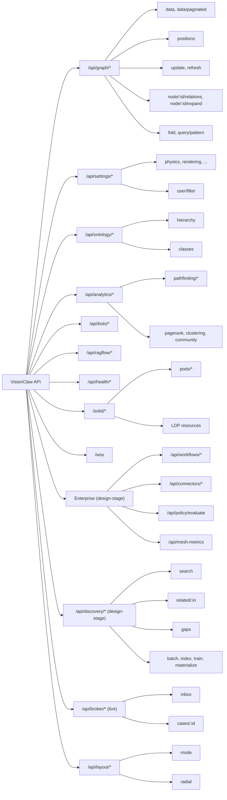
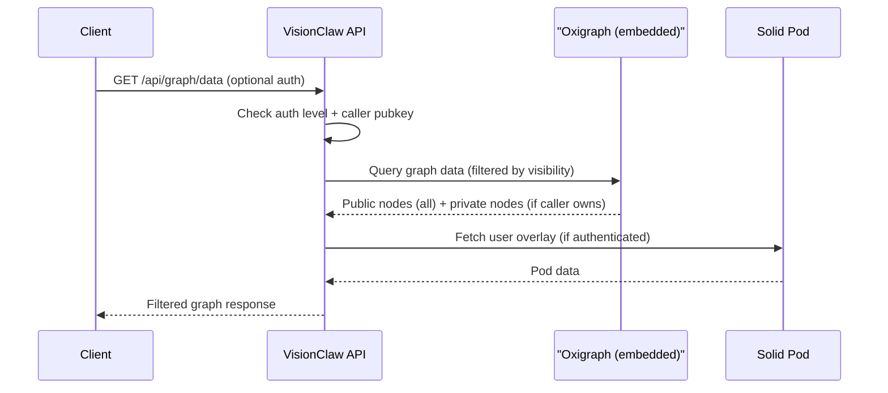

# VisionClaw REST API Reference

---

## Overview

**Base URL**: `http://localhost:4000` (development, direct) or `http://localhost:3001` (via nginx) / your deployment host (production)

All REST API paths are prefixed with `/api/` unless otherwise noted. Solid Pod endpoints use `/solid/`.

**API version**: 1.1.0
**Content-Type**: `application/json` for all requests and responses, unless otherwise noted.
**OpenAPI UI**: Available at `http://localhost:4000/swagger-ui/`

### Endpoint Taxonomy

> **Status note (2026-06-12, corrected 2026-08-09):** `/api/broker/*` is
> **live** — `src/handlers/broker_inbox_handler.rs`, mounted at
> `src/main.rs:1023`, gated by `RequireAuth::power_user()`. See
> [Broker / Governance Endpoints](#broker--governance-endpoints) below for the
> full, grep-verified route table. The remaining `Enterprise` group
> (`/api/workflows/*`, `/api/connectors/*`, `/api/policy/evaluate`,
> `/api/mesh-metrics`) and `/api/discovery/*` remain **design-stage — not
> registered in the backend router** (confirmed by zero grep hits across
> `src/main.rs` / `src/handlers/**`). Broker governance additionally flows
> over Nostr ACSP events (kinds 31400-31405, `src/services/acsp/`, ADR-110),
> with a second REST write-back at `POST /api/enrichment-proposals/{id}/decide`.



---

## Enterprise API Endpoints

> **Judgment Broker is live and documented separately** — see
> [Broker / Governance Endpoints](#broker--governance-endpoints) for the
> grep-verified route table (`GET /api/broker/inbox`,
> `GET /api/broker/cases/:id`, `POST /api/broker/cases/:id/decide`). The four
> groups below are the genuinely **design-stage — not registered** part of
> the enterprise control plane (zero `.route(`/`web::scope(` hits across
> `src/main.rs` and `src/handlers/**`). Nothing in this section is reachable
> today; treat the schemas as forward design, not a current contract.

### Workflow Proposals — `/api/workflows/*` (design-stage — not registered)

| Method | Path | Auth | Description |
|--------|------|------|-------------|
| GET | `/api/workflows/proposals` | All authenticated | List workflow proposals (status filter: Draft/Submitted/UnderReview/Approved/...) |
| POST | `/api/workflows/proposals` | Contributor+ | Submit a new workflow proposal |
| GET | `/api/workflows/proposals/:id` | All authenticated | Get proposal detail with step graph |
| POST | `/api/workflows/proposals/:id/promote` | Admin | Promote an Approved proposal to active workflow pattern |
| GET | `/api/workflows/patterns` | All authenticated | List approved, reusable workflow patterns |

---

### Connectors — `/api/connectors/*` (design-stage — not registered)

| Method | Path | Auth | Description |
|--------|------|------|-------------|
| GET | `/api/connectors` | Admin/Auditor | List configured connectors |
| POST | `/api/connectors` | Admin | Register a new connector (GitHub, Slack, Jira, Confluence, Notion) |
| GET | `/api/connectors/:id` | Admin/Auditor | Get connector config and last-sync status |
| DELETE | `/api/connectors/:id` | Admin | Remove connector and revoke credentials |

**Connector create body:**
```json
{
  "name": "string",
  "type": "GitHub | Slack | Jira | Confluence | Notion",
  "credentials": { "token": "string" },
  "redactionRules": [{ "field": "string", "pattern": "string", "action": "Redact | Hash | Drop" }],
  "syncIntervalMinutes": 60
}
```

---

### Policy Engine — `/api/policy/*` (design-stage — not registered)

| Method | Path | Auth | Description |
|--------|------|------|-------------|
| POST | `/api/policy/evaluate` | All authenticated | Evaluate an action against the current rule set |
| GET | `/api/policy/rules` | Admin/Auditor | List configured policy rules |
| PUT | `/api/policy/rules/:id` | Admin | Update a policy rule (Allow/Deny/Escalate, conditions, priority) |

**Evaluate body:**
```json
{
  "action": "string",
  "subjectRole": "Broker | Admin | Auditor | Contributor",
  "resourceType": "string",
  "context": {}
}
```

**Evaluate response:**
```json
{
  "result": "Allow | Deny | Escalate",
  "matchedRuleId": "string | null",
  "justification": "string"
}
```

---

### Mesh KPIs — `/api/mesh-metrics` (design-stage — not registered)

| Method | Path | Auth | Description |
|--------|------|------|-------------|
| GET | `/api/mesh-metrics` | Admin/Auditor | Current four KPI values with 30-day trend |
| GET | `/api/mesh-metrics?window=7d` | Admin/Auditor | KPI values for specified time window |

**Response:**
```json
{
  "meshVelocity": { "value": 36.5, "unit": "hours", "trend": [...] },
  "augmentationRatio": { "value": 0.71, "trend": [...] },
  "trustVariance": { "value": 0.09, "trend": [...] },
  "hitlPrecision": { "value": 0.94, "trend": [...] },
  "window": "30d",
  "computedAt": "2026-04-18T12:00:00Z"
}
```

See [DDD Enterprise Contexts](../explanation/ddd-enterprise-contexts.md) for the KPI definitions and lineage model.

### Authentication Summary

All mutation endpoints (POST, PUT, DELETE) require authentication. GET endpoints are public unless noted.

**Active authentication method**: Nostr keypair + session token (NIP-98 and session bearer).
**Deprecated**: JWT email/password login. Do not use in new integrations.
**Dev bypass**: Set `SETTINGS_AUTH_BYPASS=true` to treat all requests as `dev-user`.

---

## Authentication

VisionClaw uses Nostr-based identity (NIP-98) with optional, authenticated, and admin access levels. Clients can authenticate using a Nostr keypair; the server issues a session token bound to the Nostr pubkey. Anonymous access is permitted for public endpoints.

### Authentication Levels

VisionClaw supports three authentication modes via `AccessLevel` enum:

| Mode | Description | Use Case |
|------|-------------|----------|
| **Optional** | Client may authenticate but not required | Public graph data with optional caller-aware filtering |
| **Authenticated** | Client must authenticate (NIP-98 or Bearer token) | User-scoped operations, workspace mutations |
| **Admin** | Special roles only (Broker, Admin, Auditor) | System administration, policy enforcement |

### Authentication Flow



### Nostr NIP-98 Authentication

Construct a kind-27235 Nostr event and base64-encode it in the `Authorization` header.

**Required event tags**:

| Tag | Description | Required |
|-----|-------------|----------|
| `u` | Full request URL | Yes |
| `method` | HTTP method | Yes |
| `payload` | SHA-256 hex hash of request body | For POST/PUT |

**Event must satisfy**:
- `created_at` within 60 seconds of server time
- Valid Schnorr signature over the event id
- Events are single-use (replay protection enforced)

```typescript
import { generatePrivateKey, getPublicKey, finishEvent } from 'nostr-tools';

const sk = generatePrivateKey();
const pk = getPublicKey(sk);

const authEvent = finishEvent({
  kind: 27235,
  created_at: Math.floor(Date.now() / 1000),
  tags: [
    ['u', 'http://localhost:8080/api/settings/bulk'],
    ['method', 'POST'],
    ['payload', sha256HexOfBody]
  ],
  content: ''
}, sk);

const authHeader = `Nostr ${btoa(JSON.stringify(authEvent))}`;
```

### Session Token (Bearer)

After initial NIP-98 authentication, the server issues a session token (stored in `localStorage` as `nostr_session_token`). Subsequent requests may use:

```http
Authorization: Bearer <nostr_session_token>
X-Nostr-Pubkey: <hex_pubkey>
```

Session validated via `nostr_service.validate_session(&pubkey, &token)`. Expiry controlled by `AUTH_TOKEN_EXPIRY` env var (default: 3600 seconds).

**Legacy session path**: `X-Nostr-Pubkey + X-Nostr-Token` headers are gated behind `APP_ENV != production` (returns 401 in production unless explicitly enabled via feature flag). Use NIP-98 + Bearer for production integrations.

### 401 Error Response

```json
{
  "error": "Missing authorization token"
}
```

### Dev Bypass

```bash
SETTINGS_AUTH_BYPASS=true  # treats all requests as power user dev-user
POWER_USER_PUBKEYS=pubkey1,pubkey2  # comma-separated power user pubkeys
```

### Feature Flags

| Flag | Default | Description |
|------|---------|-------------|
| `NIP98_OPTIONAL_AUTH` | false | Enable optional-auth behaviour on wrappable endpoints (rollout safety) |
| `POD_DEFAULT_PRIVATE` | false | New Pods default to private visibility |
| `VISIBILITY_CLASSIFICATION` | false | Enable 4-state visibility enum (public, pod, private, opaque) |
| `POD_SAGA_ENABLED` | false | Enable Pod provisioning saga pattern with retry |
| `SOVEREIGN_SCHEMA` | false | Enable sovereign schema (ADR-050: kinds 30023/30100/30200/30300/30301/31400/31402) |

---

## Graph Endpoints

Configured in `api_handler/graph/mod.rs`.

### GET /api/graph/data

Retrieve the full graph (all nodes and edges). Optionally filter by graph type. Supports optional authentication with caller-aware visibility filtering (requires `NIP98_OPTIONAL_AUTH=true` feature flag).

**Query parameters**:

| Parameter | Type | Default | Description |
|-----------|------|---------|-------------|
| `graph_type` | string | all | Filter: `knowledge`, `ontology`, `agent` |

**Authentication**: Optional. Unauthenticated callers receive public nodes only. Authenticated callers receive public + own-private nodes. Other users' private nodes are opacified.

#### Caller-aware Filtering

When `NIP98_OPTIONAL_AUTH=true` and caller is authenticated:

- **Public nodes** (`visibility='public'`): Returned unchanged for all callers
- **Own-private nodes** (`visibility='private'` AND `n.owner_pubkey == caller_pubkey`): Returned with full metadata
- **Other-user private nodes**: Opacified (bit 29 set on node_id, label/metadata/pod_url cleared, replaced with opaque_id hash)

**Response** (200 OK):

```json
{
  "nodes": [
    {
      "id": "42",
      "label": "Design Patterns",
      "node_type": "page",
      "metadata_id": "design-patterns.md",
      "visibility": "public",
      "owner_pubkey": "abc123def456...",
      "opaque_id": null,
      "pod_url": "https://alice.pods.visionclaw.org/public/kg/design-patterns"
    },
    {
      "id": "199",
      "label": "Internal Strategy",
      "node_type": "page",
      "metadata_id": "internal-strategy.md",
      "visibility": "private",
      "owner_pubkey": "abc123def456...",
      "opaque_id": null,
      "pod_url": "https://alice.pods.visionclaw.org/private/kg/internal-strategy"
    }
  ],
  "edges": [
    {
      "id": "edge-1",
      "source": "42",
      "target": "99",
      "relationship": "LINKS_TO",
      "weight": 1.0
    }
  ],
  "node_count": 1523,
  "edge_count": 4200
}
```

#### Opacified Node Example

When caller requests graph but does not own node 545 (which is private to user XYZ):

```json
{
  "id": 545259521,
  "label": "",
  "node_type": "page",
  "metadata_id": "",
  "visibility": "private",
  "owner_pubkey": "xyz789...",
  "opaque_id": "a1b2c3d4e5f67890abcdef1234567890abcdef123456",
  "pod_url": null
}
```

**Note**: Opaque node ID = `0x20000000 | base_id` (bit 29 set). The `opaque_id` is a deterministic hash used for deduplication; label, metadata, and pod_url are cleared to prevent leakage. Edges to opacified nodes are also filtered.

Node IDs are sequential u32 starting at 1. High bits encode type and visibility flags (see WebSocket binary protocol for flag definitions). Client must use `String()` coercion when comparing IDs.

### GET /api/graph/data/paginated, GET /api/graph/positions, GET /api/graph/auto-balance-notifications

Additional read routes registered in the same live scope (`src/handlers/api_handler/graph/mod.rs:678-706`):

| Method | Path | Auth | Description |
|--------|------|------|-------------|
| GET | `/api/graph/data` | Optional | Full graph (see above) |
| GET | `/api/graph/data/paginated` | Optional | Paginated graph data |
| GET | `/api/graph/positions` | Optional | Current node positions only |
| GET | `/api/graph/auto-balance-notifications` | Optional | Auto-balance event notifications |
| POST | `/api/graph/update` | `power_user` | Full bulk reload — re-fetches and rebuilds the graph from the content source |
| POST | `/api/graph/refresh` | `authenticated` | Read-back of current graph state (no mutation) |

There is **no `GET /api/graph/stats`, `GET/POST/DELETE /api/graph/node(s)`, or per-node CRUD endpoint reachable at runtime.**

`src/handlers/graph_state_handler.rs:422-433` does define a second `web::scope("/graph")` with `/statistics`, `/nodes`, `/nodes/{id}` (GET/PUT/DELETE), `/edges`, `/edges/{id}`, `/positions/batch`, and it is wired via `.configure()` in `api_handler/mod.rs:128` — but it registers **after** the `/graph` scope above (`api_handler/mod.rs:124`), and actix-web gives the first-registered scope with a given prefix exclusive ownership of that prefix (a documented gotcha called out inline at `api_handler/graph/mod.rs:673-676`: *"actix-web claims a route prefix for the FIRST registered `web::scope("/graph")` and routes defined in later same-prefix scopes return 404"*). So `graph_state_handler`'s node/edge/statistics routes compile and are registered, but are **shadowed and unreachable in practice** — any request to them 404s inside the first `/graph` scope's router before ever reaching the handler code. Treat them as dead code, not a usable API surface, until the scope conflict is resolved in Rust.

### Node navigation, fold, and pattern-query routes

These read/compute routes back the desktop expansion trio, the XR fold ladder, and
the visual query builder. All are **public reads** in the same live `/graph` scope
(`src/handlers/api_handler/graph/mod.rs`), so no auth is required; the per-node and
pattern routes carry a per-resource `RateLimit::per_minute(120)` on top of the
scope's 600/min ceiling. The same DoS-bounded heap that guards `/graph/data`
applies — result sets are hard-capped server-side (see individual caps below).

| Method | Path | Auth | Rate limit | Handler |
|--------|------|------|-----------|---------|
| GET | `/api/graph/node/{id}/relations` | None | 120/min | `get_node_relations` (`mod.rs:989`) |
| POST | `/api/graph/node/{id}/expand` | None | 120/min | `expand_node` (`mod.rs:1020`) |
| GET | `/api/graph/fold` | None | 600/min (scope) | `fold::get_fold_plan` (`fold.rs:569`) |
| POST | `/api/graph/query/pattern` | None | 120/min | `query_pattern` (`mod.rs:1451`) |

#### GET /api/graph/node/{id}/relations

Summarise a node's edges grouped by edge type and direction. `{id}` is a `u32`
node id (masked with `NODE_ID_MASK` before lookup). No query params, no body.

**Response** (200 OK) — `RelationsResponse` (`mod.rs:726-730`):

```json
{
  "outgoing": [
    { "edgeType": "LINKS_TO", "label": "links to", "count": 12 }
  ],
  "incoming": [
    { "edgeType": "SUBCLASS_OF", "label": "subclass of", "count": 3 }
  ]
}
```

Each `RelationCount` (`mod.rs:718-724`) carries `edgeType` (string), `label`
(string), `count` (u32). Errors: `404 {"error": "Node {id} not found"}`;
`500 {"error": "Failed to retrieve graph data"}`.

#### POST /api/graph/node/{id}/expand

Fetch the neighbours reachable from `{id}` along one edge type in one direction —
the additive-expansion primitive behind the desktop "expand" action and the XR
grab-to-reveal flow. `{id}` is a masked `u32`.

**Request body** — `ExpandRequest` (`mod.rs:776-782`):

```json
{ "edgeType": "LINKS_TO", "direction": "outgoing", "limit": 25 }
```

| Field | Type | Required | Notes |
|-------|------|----------|-------|
| `edgeType` | string | Yes | Edge type to traverse |
| `direction` | `"outgoing"` \| `"incoming"` | Yes | Traversal direction |
| `limit` | integer | No | Clamped to `[1, 500]`; `0` or absent ⇒ default 25 |

**Response** (200 OK) — `ExpandResponse` (`mod.rs:810-814`):

```json
{
  "nodes": [
    { "id": 42, "metadataId": "design-patterns.md", "label": "Design Patterns", "nodeType": "page" }
  ],
  "edges": [
    { "source": 7, "target": 42, "edgeType": "LINKS_TO", "weight": 1.0 }
  ]
}
```

`ExpandNode` (`mod.rs:791-799`): `id` (u32), `metadataId` (string), `label`
(string), `nodeType` (string, omitted when absent). `ExpandEdge`
(`mod.rs:801-808`): `source`/`target` (u32), `edgeType` (string), `weight`
(f32). Errors: 404 / 500 as above.

#### GET /api/graph/fold

Return the collapse/expand plan for the semantic fold ladder (the XR
level-of-detail control). Given a fold level, the handler computes which nodes to
hide and which representative "group" nodes to show in their place.

**Query params** — `FoldQuery` (`fold.rs:72-83`):

| Param | Type | Default | Notes |
|-------|------|---------|-------|
| `level` | integer | 0 | Clamped to `[0, 3]` |
| `graphType` | string | — | `knowledge` \| `ontology` \| `agent` |
| `pinned` | string | — | Comma-separated node ids to hold visible |

**Response** (200 OK) — `FoldPlan` (`fold.rs:97-112`):

```json
{
  "level": 2,
  "graphType": "ontology",
  "generation": 41,
  "hidden": [102, 103, 210],
  "groups": [
    { "representativeId": 55, "memberIds": [102, 103], "badge": 2, "kind": "subclass" }
  ],
  "analyticsNodes": 128,
  "hierarchyEdges": 64
}
```

`generation` (u64) versions the plan so a client can discard stale ladders.
`FoldGroup.kind` (`fold.rs:87-94`) is `"subclass"` (ontology hierarchy) or
`"community"` (detected cluster). Errors: `500 {"error": "Failed to retrieve
graph data"}`.

#### POST /api/graph/query/pattern

Evaluate a small conjunctive triple pattern against the graph — the wire form the
visual query builder emits. Each triple links two terms (a concrete node id or a
`?variable`) by edge type; the handler returns variable bindings.

**Request body** — `PatternQueryRequest` (`mod.rs:1124-1131`):

```json
{
  "triples": [
    { "src": 42, "edgeType": "LINKS_TO", "tgt": "?doc" },
    { "src": "?doc", "edgeType": "AUTHORED_BY", "tgt": "?author" }
  ],
  "limit": 24,
  "countOnly": false
}
```

| Field | Type | Notes |
|-------|------|-------|
| `triples` | array of `{ src, edgeType, tgt }` | `src`/`tgt` are either a node id (JSON number) or a variable (JSON string, e.g. `"?doc"`). Max 16 triples, max 8 distinct variables |
| `limit` | integer | Clamped `[1, 500]`, default 24 |
| `countOnly` | boolean | `true` returns only `bindingCount`, skipping the binding rows |

**Response** (200 OK) — `PatternQueryResponse` (`mod.rs:1133-1147`):

```json
{
  "vars": ["?doc", "?author"],
  "bindingCount": 2,
  "truncated": false,
  "bindings": [
    { "?doc": 91, "?author": 205 }
  ]
}
```

`bindings` maps each variable name to a node id. `truncated` is `true` when the
result hit `limit`. Server-side scan caps (`mod.rs:1094-1104`):
`QUERY_SCAN_CAP = 5000` candidates, `QUERY_STEP_CAP = 2_000_000` join steps.
Errors: `400 {"error": ...}` for an empty pattern or empty variable name;
`500` on graph-fetch failure.

---

## Layout Endpoints

Configured in `src/handlers/layout_handler.rs` (`web::scope("/layout")`
mounted under `/api` at `src/main.rs:1038`). The layout scope carries **no auth
wrap and no rate limit** — both routes are public compute calls that hand work to
the GPU layout actor. They implement the ADR-141 layout programme (Sugiyama
layers, stratified/spherical modes, ego-radial RadialModes). Both take an untyped
JSON body and answer with an ad-hoc `{"success": ...}` envelope.

### POST /api/layout/mode

Switch the active graph layout algorithm. Handler `set_layout_mode`
(`layout_handler.rs:15`).

**Request body**:

```json
{ "mode": "forceDirected", "transitionMs": 500 }
```

| Field | Type | Default | Notes |
|-------|------|---------|-------|
| `mode` | string | `"forceDirected"` | `LayoutMode` (`layout.rs:9-22`): `forceDirected`, `hierarchical`, `radial`, `spectral`, `temporal`, `clustered`. Unknown values fall back to `forceDirected` |
| `transitionMs` | integer | 500 | Animation duration for the client transition |

**Response** — GPU-resident modes (`forceDirected`, `radial`, `clustered`) run on
the GPU actor and return an empty `positions` array (the client reads new
positions off the binary position stream):

```json
{ "success": true, "mode": "radial", "transitionMs": 500, "positions": [] }
```

CPU one-shot modes (`spectral`, `temporal`) compute positions inline and return
them:

```json
{
  "success": true,
  "mode": "spectral",
  "transitionMs": 500,
  "positions": [ { "id": 42, "x": 1.0, "y": 2.0, "z": 0.0 } ]
}
```

On failure: `{"success": false, "mode": "...", "error": "Failed to apply layout mode: ..."}`.

### POST /api/layout/radial

Apply an ego-radial / stratified radial arrangement. Handler `set_radial_layout`
(`layout_handler.rs:139`).

**Request body**:

```json
{ "mode": "dagRank", "focusNode": 42, "transitionMs": 500 }
```

| Field | Type | Default | Notes |
|-------|------|---------|-------|
| `mode` | string | `"dagRank"` | `RadialMode` (`layout.rs:36-44`): `dagRank` (rank by DAG depth), `typeTier` (tier by node type), `ego` (rings around a focus node) |
| `focusNode` | integer | — | Optional ego-centre node id (used by `ego` mode) |
| `transitionMs` | integer | 500 | Transition duration |

**Response**:

```json
{ "success": true, "mode": "ego", "focusNode": 42, "transitionMs": 500 }
```

Unknown modes are **not** rejected at the HTTP layer — they return `200` with
`{"success": false, "mode": "...", "error": "..."}` (`layout_handler.rs:158-164`),
as does an actor-reject or unavailable GPU actor.

---

## Settings Endpoints

Configured in `settings/api/settings_routes.rs` (`configure_routes`, mounted at
`src/main.rs:947-949` under `web::scope("/settings")` with a 60 req/min rate
limit). There is **no generic key-based `GET/PUT/DELETE /api/settings/:key`
or `POST /api/settings/bulk`** — that surface belonged to the old
`settings_handler::config` (`src/handlers/settings_handler/routes.rs`, which
also defined `/settings/path`, `/settings/schema`, `/settings/current`,
`/settings/reset`, `/settings/save`), which is dead code: its `.configure()`
call is commented out at `api_handler/mod.rs:138-139` ("OLD settings_handler
disabled — using new SettingsActor routes"). All endpoints below are the live
`OptimizedSettingsActor`-backed replacement (the never-started `SettingsActor` was
deleted by ADR-2046 on 2026-09-05). All mutation endpoints require
authentication; reads are open.

### GET /api/settings/all

Get the full settings object.

**Response** (200 OK): Full settings object (JSON-serialized).

### GET /api/settings/user/filter

Get the authenticated user's personal graph filter settings.

**Response** (200 OK):

```json
{
  "pubkey": "3bf0c63f...",
  "enabled": true,
  "quality_threshold": 0.8,
  "authority_threshold": 0.6,
  "filter_by_quality": true,
  "filter_by_authority": false,
  "filter_mode": "or",
  "max_nodes": 5000,
  "updated_at": "2026-04-09T10:00:00Z"
}
```

### PUT /api/settings/user/filter

Update the authenticated user's personal filter settings.

```http
PUT /api/settings/user/filter
Authorization: Bearer <token>
X-Nostr-Pubkey: <pubkey>
Content-Type: application/json

{
  "enabled": true,
  "quality_threshold": 0.8,
  "authority_threshold": 0.6,
  "filter_by_quality": true,
  "filter_by_authority": false,
  "filter_mode": "or",
  "max_nodes": 5000
}
```

**Response** (200 OK): Updated filter object.

### Settings Sub-routes

Full list registered by `settings_routes.rs:1404-1430` (`configure_routes`). GET reads are open; PUT/POST/DELETE require authentication.

| Method | Path | Description |
|--------|------|-------------|
| GET / PUT | `/api/settings/physics` | Physics simulation parameters |
| POST | `/api/settings/physics/reset-layout` | Reset layout to canonical defaults and re-heat physics |
| GET / PUT | `/api/settings/constraints` | Ontology constraint weights |
| GET / PUT | `/api/settings/rendering` | Rendering quality settings |
| GET / PUT | `/api/settings/node-filter` | Global node filter |
| GET / PUT | `/api/settings/quality-gates` | Quality gate thresholds |
| GET / PUT | `/api/settings/visual` | Visual settings |
| GET | `/api/settings/all` | Full settings object |
| POST | `/api/settings/profiles` | Save a named settings profile |
| GET | `/api/settings/profiles` | List saved profiles |
| GET | `/api/settings/profiles/{id}` | Load a saved profile |
| DELETE | `/api/settings/profiles/{id}` | Delete a saved profile |
| GET / PUT | `/api/settings/user/filter` | Authenticated user's personal graph filter (see above) |

---

## Ontology Endpoints

Configured in `ontology_handler.rs`. Note: `/api/ontology-agent/*` **read** endpoints (`discover`, `read`, `query`, `traverse`, `validate`, `status`) are anonymous; only `POST /api/ontology-agent/propose` is authenticated (`power_user`) and rate-limited — the governed write anchor. (Historically the whole scope was left unwrapped; the WS-1 fix re-gated `/propose` specifically, per ADR-028-ext.)

### GET /api/ontology/classes

List all OWL classes from the loaded ontology.

**Response** (200 OK):

```json
{
  "classes": [
    {
      "iri": "http://example.org/Person",
      "label": "Person",
      "subclassOf": null
    }
  ],
  "total": 623
}
```

### GET /api/ontology/hierarchy

Get the full OWL class hierarchy.

**Query parameters**:

| Parameter | Type | Default | Description |
|-----------|------|---------|-------------|
| `ontology-id` | string | `default` | Ontology identifier |
| `max-depth` | integer | unlimited | Maximum hierarchy depth |

**Response** (200 OK):

```json
{
  "rootClasses": ["http://example.org/Person"],
  "hierarchy": {
    "http://example.org/Person": {
      "iri": "http://example.org/Person",
      "label": "Person",
      "parentIri": null,
      "childrenIris": ["http://example.org/Student", "http://example.org/Teacher"],
      "nodeCount": 5,
      "depth": 0
    }
  }
}
```

**Caching**: Results cached for 1 hour with ontology hash validation.

### GET /api/ontology/properties

List all OWL object and datatype properties.

### GET /api/ontology/axioms

List all ontology axioms (SubClassOf, DisjointWith, etc.).

### GET /api/ontology/individuals

List all ontology individuals.

### GET /api/ontology/disjoint-classes

Get all disjoint class pairs.

**Response** (200 OK):

```json
{
  "disjoint-pairs": [
    { "classA": "http://example.org/Animal", "classB": "http://example.org/Plant" }
  ]
}
```

### POST /api/ontology/load

Load an ontology file (OWL/RDF format). No authentication required (controlled by backend config).

```http
POST /api/ontology/load
Content-Type: application/json

{ "ontology-id": "default", "source": "path/to/ontology.owl" }
```

### POST /api/ontology/classify

Run OWL classification (Whelk EL++ reasoner).

**Response** (200 OK):

```json
{
  "inferred-axioms": [
    {
      "axiomType": "SubClassOf",
      "subjectIri": "http://example.org/GraduateStudent",
      "objectIri": "http://example.org/Person",
      "confidence": 0.95,
      "reasoningMethod": "whelk-el++"
    }
  ],
  "cache-hit": false,
  "reasoning-time-ms": 245
}
```

---

## Ontology Physics Endpoints

Configured in `api_handler/ontology_physics/mod.rs:477-484` (`configure_routes`). All five routes do real GPU-actor work via `state.gpu_manager_addr` — **none return 501.**

| Method | Path | Auth | Description |
|--------|------|------|-------------|
| POST | `/api/ontology-physics/enable` | Yes | Enable ontology-derived physics constraints |
| POST | `/api/ontology-physics/disable` | Yes | Disable ontology forces (clears constraints via `ApplyOntologyConstraints`) |
| GET | `/api/ontology-physics/constraints` | No | Get active physics constraints |
| PUT | `/api/ontology-physics/weights` | Yes | Adjust constraint weights (`AdjustConstraintWeights` GPU actor message) |
| GET | `/api/ontology-physics/trust-status` | No | Get trust-weighted constraint status |

There is no `POST /api/ontology-physics/constraints` (add-constraint) or `POST /api/ontology-physics/reset` — those are not registered.

### POST /api/constraints/generate

Generate physics constraints from ontology axioms.

```http
POST /api/constraints/generate
Content-Type: application/json

{
  "ontology-id": "default",
  "constraint-types": ["Separation", "HierarchicalAttraction"],
  "config": {
    "disjoint-repel-multiplier": 2.0,
    "subclass-spring-multiplier": 0.5
  }
}
```

**Response** (200 OK):

```json
{
  "constraints": [
    {
      "constraintType": "Separation",
      "nodeA": "http://example.org/Animal",
      "nodeB": "http://example.org/Plant",
      "minDistance": 70.0,
      "strength": 0.8,
      "priority": 5
    },
    {
      "constraintType": "HierarchicalAttraction",
      "child": "http://example.org/Student",
      "parent": "http://example.org/Person",
      "idealDistance": 20.0,
      "strength": 0.3,
      "priority": 5
    }
  ],
  "total-count": 245,
  "generation-time-ms": 123
}
```

---

## Analytics and Pathfinding Endpoints

Configured in `api_handler/analytics/mod.rs:148-267` (`config`, single `web::scope("/analytics")` wrapped with `RequireAuth::authenticated().mutations_only()` — POSTs require auth, the listed GETs are public). All pathfinding and GPU analytics endpoints require the `gpu` feature flag at compile time and a CUDA-capable GPU.

### Standard Analytics

The endpoints below are the full, grep-verified `/api/analytics/*` surface. Several paths previously documented here (`/metrics`, `/pagerank`, `/clustering`, `/community`, `/anomaly`, `/centrality`, `/clusters`, `/communities`, `/embedding`, `/similarity`, `/filter`, `/summary`, `/layout/force`, `/layout/stress`) are **not registered** — the real routes live one level deeper, e.g. `/pagerank/compute` not `/pagerank`.

| Method | Path | Auth | Description |
|--------|------|------|-------------|
| POST | `/api/analytics/params` | Yes | Update analytics parameters |
| POST | `/api/analytics/constraints` | Yes | Update physics constraints |
| POST | `/api/analytics/focus` | Yes | Set graph focus |
| POST | `/api/analytics/kernel-mode` | Yes | Set GPU kernel mode |
| POST | `/api/analytics/clustering/run` | Yes | Run clustering |
| POST | `/api/analytics/clustering/focus` | Yes | Focus a cluster |
| POST | `/api/analytics/clustering/cancel` | Yes | Cancel a running clustering job |
| POST | `/api/analytics/clustering/dbscan` | Yes | Run DBSCAN clustering |
| POST | `/api/analytics/community/detect` | Yes | Run Louvain community detection |
| POST | `/api/analytics/anomaly/detect` | Yes | Run GPU LOF/Z-score structural anomaly detection |
| POST | `/api/analytics/anomaly/toggle` | Yes | Toggle agent-health anomaly heuristic |
| POST | `/api/analytics/sssp/params` \| `/compute` \| `/toggle` | Yes | SSSP parameter/compute/toggle |
| POST | `/api/analytics/stress-majorization/trigger` \| `/reset-safety` \| `/params` \| `/configure` | Yes | Stress-majorization layout control |
| POST | `/api/analytics/feature-flags` | Yes | Update feature flags |
| POST | `/api/analytics/pagerank/compute` | Yes | Run PageRank |
| POST | `/api/analytics/pagerank/clear` | Yes | Clear PageRank cache |
| POST | `/api/analytics/pathfinding/sssp` \| `/apsp` \| `/path` \| `/connected-components` | Yes | Pathfinding computations (see below) |
| GET | `/api/analytics/pathfinding/stats/sssp` \| `/stats/components` | No | Pathfinding stats |
| GET | `/api/analytics/params` \| `/constraints` \| `/stats` | No | Read back current params/constraints/performance stats |
| GET | `/api/analytics/gpu-metrics` \| `/gpu-status` \| `/gpu-features` | No | GPU telemetry |
| GET | `/api/analytics/clustering/status` | No | Clustering status |
| GET | `/api/analytics/community/statistics` | No | Community detection statistics |
| GET | `/api/analytics/anomaly/current` \| `/anomaly/config` | No | Current anomalies / anomaly config |
| GET | `/api/analytics/insights` \| `/insights/realtime` | No | AI insights |
| GET | `/api/analytics/sssp/status` | No | SSSP status |
| GET | `/api/analytics/stress-majorization/stats` \| `/config` | No | Stress-majorization stats/config |
| GET | `/api/analytics/dashboard-status` \| `/health-check` \| `/feature-flags` | No | Dashboard/health/feature-flag reads |
| GET | `/api/analytics/pagerank/result` | No | Last PageRank result |
| GET | `/api/analytics/ws` (upgrade) | Yes | GPU analytics WebSocket |

### POST /api/analytics/pathfinding/path

Find the shortest path between two nodes. **Note:** this is a POST with a JSON body — there is no `GET /api/analytics/pathfinding/:source/:target` route.

**Response** (200 OK):

```json
{
  "path": [0, 5, 12, 42],
  "distance": 3.0,
  "computation_time_ms": 8
}
```

### POST /api/analytics/pathfinding/sssp

GPU-accelerated single-source shortest path from a source node to all reachable nodes.

**Request**:

```json
{ "sourceIdx": 0, "maxDistance": 5.0 }
```

**Parameters**:

| Field | Type | Required | Description |
|-------|------|----------|-------------|
| `sourceIdx` | integer | Yes | Source node index |
| `maxDistance` | float | No | Distance cutoff (omit for full graph) |

**Response** (200 OK):

```json
{
  "success": true,
  "result": {
    "distances": [0.0, 1.5, 2.3, 3.1],
    "sourceIdx": 0,
    "nodesReached": 1234,
    "maxDistance": 4.8,
    "computationTimeMs": 15
  },
  "error": null
}
```

`distances` is indexed by node index; `f32::MAX` means unreachable.

### POST /api/analytics/pathfinding/apsp

Approximate all-pairs shortest path using landmark-based method.

**Request**:

```json
{ "numLandmarks": 10, "seed": 42 }
```

**Response** (200 OK):

```json
{
  "success": true,
  "result": {
    "distances": [0.0, 1.5, 2.3],
    "numNodes": 1000,
    "numLandmarks": 10,
    "landmarks": [5, 123, 456, 789],
    "avgErrorEstimate": 0.15,
    "computationTimeMs": 245
  }
}
```

`distances` is a flattened `numNodes x numNodes` row-major matrix. Access: `distances[i * numNodes + j]`.

### POST /api/analytics/pathfinding/connected-components

Detect disconnected graph regions using GPU label propagation.

**Request**:

```json
{ "maxIterations": 100 }
```

**Response** (200 OK):

```json
{
  "success": true,
  "result": {
    "labels": [0, 0, 0, 1, 1, 2],
    "numComponents": 3,
    "componentSizes": [1024, 512, 256],
    "largestComponentSize": 1024,
    "isConnected": false,
    "iterations": 8,
    "computationTimeMs": 42
  }
}
```

### GET /api/analytics/pathfinding/stats/sssp

Pathfinding computation performance statistics.

**Response** (200 OK):

```json
{
  "totalSsspComputations": 142,
  "totalApspComputations": 8,
  "avgSsspTimeMs": 12.3,
  "avgApspTimeMs": 234.5,
  "lastComputationTimeMs": 15
}
```

### GET /api/analytics/pathfinding/stats/components

Connected components computation statistics.

**Response** (200 OK):

```json
{
  "totalComputations": 25,
  "avgComputationTimeMs": 38.2,
  "avgNumComponents": 3.4,
  "lastNumComponents": 4
}
```

### Pathfinding Error Responses

| Error | Cause |
|-------|-------|
| `"GPU features not enabled"` | Compiled without `gpu` feature |
| `"Shortest path actor not available"` | GPU compute actor not initialized |
| `"Number of landmarks (N) must be less than number of nodes (M)"` | Invalid APSP parameters |
| `"Actor communication error: mailbox closed"` | Actor system failure |

**Performance characteristics**:

| Algorithm | Typical Time | GPU Speedup |
|-----------|-------------|-------------|
| SSSP | 10-50ms (1K-10K nodes) | ~100x vs CPU |
| APSP (10 landmarks) | 100-500ms (1K nodes) | N/A (approximate) |
| Connected Components | 20-100ms (1K-10K nodes) | ~50x vs CPU |

---

## Semantic Forces and Schema Endpoints

### Semantic Forces — `/api/semantic-forces/*`

Configured in `api_handler/semantic_forces.rs:649-663` (`config`). Every route below does real work against the GPU manager actor (`GetHierarchyLevels`, `GetSemanticConfig`, `RecalculateHierarchy` messages) — **none return 501.** The path is `/hierarchy-levels`, not `/hierarchy`.

| Method | Path | Auth | Description |
|--------|------|------|-------------|
| POST | `/api/semantic-forces/dag/configure` | Yes | Configure DAG layout mode/spacing |
| POST | `/api/semantic-forces/type-clustering/configure` | Yes | Configure type-clustering forces |
| POST | `/api/semantic-forces/collision/configure` | Yes | Configure collision avoidance |
| GET | `/api/semantic-forces/hierarchy-levels` | No | Get hierarchy levels (GPU actor: `GetHierarchyLevels`) |
| GET | `/api/semantic-forces/config` | No | Get current semantic forces config (GPU actor: `GetSemanticConfig`) |
| POST | `/api/semantic-forces/hierarchy/recalculate` | Yes | Recalculate hierarchy levels (GPU actor: `RecalculateHierarchy`) |
| GET | `/api/semantic-forces/relationship-types` | No | List relationship types |
| POST | `/api/semantic-forces/relationship-types` | Yes | Register a new relationship type |
| POST | `/api/semantic-forces/relationship-types/reload` | Yes | Sync relationship-type registry to GPU |
| GET / PUT | `/api/semantic-forces/relationship-types/{uri}` | No / Yes | Get / update a relationship type's force parameters |

There is no `/api/semantic-forces/compute`, `/weights`, or `/reset` — those are not registered.

### Schema Endpoints

| Method | Path | Description |
|--------|------|-------------|
| GET | `/api/schema` | Get complete graph schema |
| GET | `/api/schema/node-types` | List node types with counts |
| GET | `/api/schema/edge-types` | List edge types with counts |

### Natural Language Query

| Method | Path | Description |
|--------|------|-------------|
| POST | `/api/nl-query/translate` | Translate natural language to a Cypher-style query (resolved against the embedded Oxigraph store; `cypher` field kept for backwards compatibility, ADR-2004) |
| GET | `/api/nl-query/examples` | Get example queries |
| POST | `/api/nl-query/explain` | Explain a query |
| POST | `/api/nl-query/validate` | Validate query syntax |

### Semantic Pathfinding

| Method | Path | Description |
|--------|------|-------------|
| POST | `/api/pathfinding/semantic-path` | Find shortest semantic path |
| POST | `/api/pathfinding/query-traversal` | Explore graph by query |
| POST | `/api/pathfinding/chunk-traversal` | Explore local neighborhood |

---

## Sync Endpoints

### Admin Sync — `/api/admin/sync/*`

Trigger GitHub → graph-store (embedded Oxigraph) synchronization.

| Method | Path | Description |
|--------|------|-------------|
| POST | `/api/admin/sync/trigger` | Trigger full sync (respects SHA1 incremental filter) |
| POST | `/api/admin/sync/force` | Force full re-sync regardless of SHA1 cache |
| GET | `/api/admin/sync/status` | Get last sync status and timestamp |

Set `FORCE_FULL_SYNC=1` environment variable to bypass SHA1 incremental filtering for a single run, then reset to 0.

**Sync flow**: `GitHubSyncService::sync_graphs()` → `EnhancedContentAPI::list_markdown_files("")` → `KnowledgeGraphParser::parse()` → embedded Oxigraph store.

Only files tagged `public:: true` become knowledge graph page nodes. Ontology data is extracted from all files with `### OntologyBlock`, regardless of `public:: true` status.

---

## Discovery & Feature Engineering — `/api/discovery/*` (design-stage — not registered)

There is no `discovery_handler.rs` and no `/api/discovery/*` route in the router (zero grep hits across `src/`). Everything in this section is unbuilt design, not a current contract. It combines content embeddings (MiniLM-L6, 384-dim) with topology embeddings (TransE, 128-dim) for semantic search and ontology gap detection. See [ADR-072](../archive/adr/ADR-072-autordf2gml-feature-engineering.md).

> **Don't conflate this with the operational memory stack:** the MiniLM-L6
> embedding model named here is part of this unbuilt discovery design
> (ADR-072) and is unrelated to the RuVector memory system's operational
> embedding model, `bge-small-en-v1.5` (384-dim, served via Xinference) — that
> stack is live today and backs `mcp__claude-flow__memory_*`, not this API.

### GET /api/discovery/search

Combined content + topology similarity search.

| Parameter | Type | Default | Description |
|-----------|------|---------|-------------|
| `q` | string | (required) | Free-text search query |
| `top_k` | integer | 10 | Maximum results |
| `content_weight` | float | 0.6 | Weight for content similarity (0.0–1.0) |
| `topology_weight` | float | 0.4 | Weight for topology similarity (0.0–1.0) |

**Response 200:**
```json
{
  "results": [
    { "iri": "string", "label": "string", "score": 0.87, "content_score": 0.92, "topology_score": 0.79 }
  ],
  "query": "string",
  "total": 5
}
```

### GET /api/discovery/related/{iri}

Find nodes related to a given IRI by combined similarity.

| Parameter | Type | Default | Description |
|-----------|------|---------|-------------|
| `iri` | path | (required) | Node IRI to find relatives of |
| `top_k` | integer | 5 | Maximum results |

**Response 200:** Same shape as `/search` results.
**Response 404:** Node with given IRI not found.

### GET /api/discovery/gaps

Detect ontology gaps — pairs of nodes with high semantic similarity but no direct edge.

| Parameter | Type | Default | Description |
|-----------|------|---------|-------------|
| `min_score` | float | 0.3 | Minimum combined similarity threshold |
| `limit` | integer | 20 | Maximum gaps to return |

**Response 200:**
```json
{
  "gaps": [
    { "source_iri": "string", "target_iri": "string", "score": 0.72, "suggested_relation": "string" }
  ],
  "total": 3
}
```

### POST /api/discovery/batch

Batch similarity computation for multiple IRIs.

**Request body:**
```json
{
  "iris": ["urn:visionclaw:concept:a", "urn:visionclaw:concept:b"],
  "top_k": 3
}
```

**Response 200:** Per-IRI similarity results.

### POST /api/discovery/index

**Admin.** Trigger content embedding indexing of all ontology nodes via MiniLM-L6-v2.

**Response 200:**
```json
{
  "status": "complete",
  "nodes_processed": 2834,
  "nodes_embedded": 2834,
  "nodes_skipped": 0,
  "batches_sent": 45
}
```

### POST /api/discovery/train

**Admin.** Trigger TransE knowledge graph embedding training on the full edge set. Long-running (may exceed default proxy timeouts for large graphs).

**Response 200:**
```json
{
  "status": "complete",
  "num_entities": 2834,
  "num_relations": 12,
  "num_triples": 8502,
  "final_loss": 0.312,
  "epochs_completed": 100,
  "duration_ms": 45000
}
```

### POST /api/discovery/materialize

**Admin.** Trigger N-hop edge materialisation. Requires `NHOP_MATERIALIZATION_ENABLED=true` environment variable.

**Response 200:**
```json
{
  "status": "complete",
  "two_hop_edges_created": 1250,
  "three_hop_edges_created": 3400,
  "nodes_processed": 2834,
  "duration_ms": 12000
}
```

**Response 503:** Materialisation disabled (env var not set).

---

## AI / Agent Endpoints

### Bots — `/api/bots/*`

Configured in `bots_handler.rs`.

| Method | Path | Auth | Description |
|--------|------|------|-------------|
| GET | `/api/bots` | No | List registered bots |
| GET | `/api/bots/:id` | No | Get bot details |
| POST | `/api/bots/register` | Yes | Register new bot |
| PUT | `/api/bots/:id` | Yes | Update bot config |
| DELETE | `/api/bots/:id` | Yes | Unregister bot |
| POST | `/api/bots/update` | Yes | Push bot telemetry (triggers agent pipeline) |

**Example: Register a bot**:

```http
POST /api/bots/register
Authorization: Bearer <token>
Content-Type: application/json

{
  "name": "knowledge-curator",
  "description": "Automated knowledge graph curation agent",
  "pubkey": "3bf0c63f..."
}
```

**Response** (201 Created):

```json
{
  "id": "bot-001",
  "name": "knowledge-curator",
  "pubkey": "3bf0c63f...",
  "registered_at": "2026-04-09T10:00:00Z"
}
```

### RAGFlow — `/api/ragflow/*`

Configured in `ragflow_handler.rs`.

| Method | Path | Auth | Description |
|--------|------|------|-------------|
| GET | `/api/ragflow/status` | No | RAGFlow integration status |
| POST | `/api/ragflow/query` | Yes | Submit RAG query |
| POST | `/api/ragflow/index` | Yes | Trigger document indexing |
| POST | `/api/ragflow/config` | Yes | Update RAGFlow config |

### Briefing API — `/api/briefs/*`

Bridges the VisionClaw frontend to the Management API agent container for the VisionClaw briefing workflow.

#### POST /api/briefs

Submit a new brief and spawn role agents.

```http
POST /api/briefs
Content-Type: application/json

{
  "briefing": {
    "content": "Analyze the design patterns knowledge graph for clustering opportunities",
    "roles": ["analyst", "curator", "reviewer"]
  },
  "user_context": {
    "display_name": "John",
    "pubkey": "3bf0c63f..."
  }
}
```

**Response** (201 Created):

```json
{
  "brief_id": "brief-abc123",
  "bead_id": "bead-xyz789",
  "path": "/briefs/brief-abc123",
  "role_tasks": [
    { "task_id": "task-001", "role": "analyst", "bead_id": "bead-001" },
    { "task_id": "task-002", "role": "curator", "bead_id": "bead-002" }
  ]
}
```

#### POST /api/briefs/:brief_id/debrief

Request a consolidated debrief. On success, the `BeadLifecycleOrchestrator` (ADR-034)
creates a bead in `Created` state, publishes a Nostr kind 30001 provenance event with
retry (configurable via `BEAD_RETRY_*` env vars), persists the `(:NostrEvent)-[:PROVENANCE_OF]->(:Bead)`
provenance record to the embedded Oxigraph store, and tracks the full lifecycle. Every publish
attempt produces a typed `BeadOutcome` (Success, RelayTimeout, RelayRejected, RelayUnreachable,
SigningFailed, GraphStoreWriteFailed, BridgeFailed) — no silent failures. Requires `VISIONCLAW_NOSTR_PRIVKEY`.

```http
POST /api/briefs/brief-abc123/debrief
Content-Type: application/json

{
  "role_tasks": [
    { "task_id": "task-001", "role": "analyst", "bead_id": "bead-001" }
  ],
  "user_context": {
    "display_name": "John",
    "pubkey": "3bf0c63f..."
  }
}
```

**Response** (201 Created):

```json
{
  "brief_id": "brief-abc123",
  "debrief_path": "/briefs/brief-abc123/debrief"
}
```

---

## Server Identity Endpoint

### GET /api/server/identity

Retrieve server identity, supported event kinds, and relay information. Public endpoint, no authentication required. This endpoint is foundational for ADR-050 sovereign schema support.

**Response** (200 OK):

```json
{
  "pubkey_hex": "abc123def456...",
  "pubkey_npub": "npub1abc123def456...",
  "supported_kinds": [
    30023,
    30100,
    30200,
    30300,
    30301,
    31400,
    31402
  ],
  "relay_urls": [
    "wss://relay.example.org",
    "wss://relay.visionclaw.org"
  ]
}
```

**Schema reference**: See ADR-050 for sovereign schema kinds (30023: migration approval, 30100: bridge promotion, 30200: bead stamp, 30300: audit/broker decision, 30301: enrichment proposal). Kinds 31400 (governance panel definition) and 31402 (action request) are Agent Control Surface Protocol events published by the ACSP producer (`ElevationActor`, ADR-110) over the storage-agnostic broker kernel for governance integration with the Forum Kit relay mesh (ADR-130 Decision 2; the earlier `BrokerActor` transport never merged to `main`).

---

## Constraints and Workspace Endpoints

### Constraints — `/api/constraints/*`

Configured in `constraints_handler.rs`.

| Method | Path | Auth | Description |
|--------|------|------|-------------|
| GET | `/api/constraints` | No | List all constraints |
| GET | `/api/constraints/stats` | No | Constraint statistics |
| POST | `/api/constraints` | Yes | Create constraint |
| PUT | `/api/constraints/:id` | Yes | Update constraint |
| DELETE | `/api/constraints/:id` | Yes | Delete constraint |
| POST | `/api/constraints/validate` | Yes | Validate constraint set |
| POST | `/api/constraints/generate` | No | Generate from ontology (see Ontology Physics section) |

### Workspace API — `/api/workspace/*`

Configured in `workspace_handler.rs`. All endpoints require authentication (Nostr session or Bearer token via `RequireAuth` middleware). Rate limit: 60 requests/minute per authenticated user.

| Method | Path | Description |
|--------|------|-------------|
| GET | `/api/workspace/list` | List workspaces with pagination and filtering |
| POST | `/api/workspace/create` | Create a new workspace |
| GET | `/api/workspace/count` | Count workspaces matching current filter |
| GET | `/api/workspace/{id}` | Get a single workspace by ID |
| PUT | `/api/workspace/{id}` | Update workspace metadata |
| DELETE | `/api/workspace/{id}` | Soft-delete workspace (sets `status = deleted`, data retained) |
| POST | `/api/workspace/{id}/favorite` | Toggle favourite status |
| POST | `/api/workspace/{id}/archive` | Archive or unarchive workspace |

**List query parameters** (`GET /api/workspace/list`):

| Parameter | Type | Description |
|-----------|------|-------------|
| `page` | integer | Page number (default: 0) |
| `page_size` | integer | Results per page (default: 20) |
| `sort_by` | string | `name \| lastAccessed \| createdAt \| updatedAt` |
| `sort_direction` | string | `asc \| desc` |
| `status` | string | Filter by status: `active \| archived` |
| `type` | string | Filter by type: `personal \| team \| public` |
| `search` | string | Text search across name and description |

**Create body** (`POST /api/workspace/create`):

```json
{
  "name": "string",
  "description": "string",
  "type": "personal | team | public",
  "settings": {
    "autoSave": true,
    "syncEnabled": false,
    "collaborationEnabled": false,
    "backupEnabled": true,
    "maxMembers": 10
  }
}
```

**Update body** (`PUT /api/workspace/{id}`) — all fields optional:

```json
{
  "name": "string",
  "description": "string",
  "type": "personal | team | public",
  "settings": { }
}
```

**Workspace model**:

```typescript
interface Workspace {
  id: string;
  name: string;
  description: string;
  type: 'personal' | 'team' | 'public';
  status: 'active' | 'archived';
  memberCount: number;
  lastAccessed: Date;
  createdAt: Date;
  updatedAt: Date;
  favorite: boolean;
  settings?: {
    autoSave: boolean;
    syncEnabled: boolean;
    collaborationEnabled: boolean;
    backupEnabled: boolean;
    maxMembers: number;
  };
}
```

**Soft delete**: `DELETE /api/workspace/{id}` sets `status = deleted` and retains all data. Deleted workspaces do not appear in list results by default but can be recovered by an admin. This differs from the constraints `DELETE` which performs a hard delete.

---

## Solid Pod Endpoints

**Base URL**: `http://localhost:9090/solid`

All Solid Pod operations require Nostr NIP-98 authentication. LDP operations follow the [W3C Linked Data Platform](https://www.w3.org/TR/ldp/) specification.

### Pod Management

#### POST /solid/pods

Create a new Solid Pod for the authenticated user.

```http
POST /solid/pods
Authorization: Nostr <base64_signed_event>
Content-Type: application/json

{
  "name": "my-knowledge-base",
  "template": "visionclaw-default"
}
```

**Available templates**:

| Template | Description |
|----------|-------------|
| `visionclaw-default` | Full VisionClaw structure with memories, ontologies, graphs |
| `minimal` | Basic profile and preferences only |
| `agent-focused` | Optimised for agent memory storage |
| `ontology-contributor` | Focus on ontology proposals |

**Response** (201 Created):

```json
{
  "url": "/pods/npub1abc.../my-knowledge-base/",
  "webId": "https://visionclaw.example/id/npub1abc.../profile/card#me",
  "created": "2026-04-09T10:00:00Z",
  "template": "visionclaw-default",
  "containers": [
    "/pods/npub1abc.../my-knowledge-base/profile/",
    "/pods/npub1abc.../my-knowledge-base/agent-memories/",
    "/pods/npub1abc.../my-knowledge-base/ontologies/",
    "/pods/npub1abc.../my-knowledge-base/graphs/"
  ]
}
```

#### GET /solid/pods

List all Pods for the authenticated user.

**Response** (200 OK):

```json
{
  "pods": [
    {
      "name": "my-knowledge-base",
      "url": "/pods/npub1abc.../my-knowledge-base/",
      "created": "2026-04-09T10:00:00Z",
      "template": "visionclaw-default"
    }
  ],
  "totalCount": 1,
  "storageUsed": 512000,
  "storageQuota": 104857600
}
```

#### GET /solid/pods/check

Check if a specific Pod exists.

**Query**: `?name=my-knowledge-base`

**Response** (200 OK): `{ "exists": true, "url": "...", "size": 102400, "resourceCount": 42 }`

#### DELETE /solid/pods/:name

Delete a Pod and all its contents. Returns 204 No Content.

### LDP Resource Operations

All paths relative to `http://localhost:9090/solid`.

#### GET /solid/{path}

Read a resource or container. Supports content negotiation:

| Accept Header | Format |
|---------------|--------|
| `application/ld+json` | JSON-LD (default) |
| `text/turtle` | Turtle RDF |
| `application/n-triples` | N-Triples |

**Response** includes `ETag` and `Link` headers per LDP spec.

#### PUT /solid/{path}

Replace resource. Supports `If-Match` for optimistic concurrency.

#### POST /solid/{path}

Create resource in container. Optional `Slug` header for suggested name.

**Response**: 201 Created with `Location` header.

#### DELETE /solid/{path}

Remove resource. Returns 204 No Content.

#### PATCH /solid/{path}

Apply partial update using SPARQL UPDATE or N3 Patch.

```http
PATCH /solid/pods/npub1abc.../profile/card
Content-Type: application/sparql-update

PREFIX foaf: <http://xmlns.com/foaf/0.1/>
DELETE { <#me> foaf:name ?old }
INSERT { <#me> foaf:name "New Name" }
WHERE { <#me> foaf:name ?old }
```

**Response** (200 OK): `{ "success": true, "triples": { "added": 1, "removed": 1 } }`

### Solid Pod Error Codes

| Code | HTTP Status | Description |
|------|-------------|-------------|
| `UNAUTHORIZED` | 401 | Missing or invalid authentication |
| `FORBIDDEN` | 403 | Insufficient permissions |
| `NOT_FOUND` | 404 | Resource does not exist |
| `CONFLICT` | 409 | Resource exists or version conflict |
| `INVALID_RDF` | 400 | Malformed RDF content |
| `INVALID_CONTENT_TYPE` | 415 | Unsupported media type |
| `PRECONDITION_FAILED` | 412 | If-Match/If-None-Match failed |
| `QUOTA_EXCEEDED` | 507 | Storage quota exceeded |

---

## Additional Endpoints

### Health and Monitoring

Configured in `consolidated_health_handler.rs` (mounted under the `/api` scope).

| Method | Path | Kind | Description |
|--------|------|------|-------------|
| GET | `/api/healthz` | Liveness | Returns `200 {"status":"alive"}` immediately with no subsystem checks. Use for the container/orchestrator liveness probe |
| GET | `/api/readyz` | Readiness | Returns `200 {"status":"ready"}` when the app can serve traffic; returns `503 {"status":"not_ready","reason":...}` while the app is in a DEGRADED state (e.g. the embedded Oxigraph store failed to populate). Use for the readiness/healthcheck probe |
| GET | `/api/health` | Diagnostics | Consolidated diagnostic health (graph store, GPU, actors) |
| GET | `/api/health/physics` | Diagnostics | Physics-simulation health and parameter sanity |
| GET | `/api/health/metrics` | Diagnostics | Prometheus-compatible metrics |

> **Probe vs diagnostic**: `/api/healthz` and `/api/readyz` are the cheap probes for orchestration —
> `healthz` never fails while the process is up; `readyz` reflects DEGRADED startup state. `/api/health`
> is the richer diagnostic endpoint and may do work, so it is not suitable as a high-frequency probe.

**`/api/health` response** (200 OK):

```json
{
  "status": "healthy",
  "graph_store": "connected",
  "gpu": "available",
  "actors": {
    "physics_orchestrator": "running",
    "broadcast_optimizer": "running"
  },
  "uptime_seconds": 3600
}
```

### Quest3 XR

Configured in `api_handler/quest3/mod.rs`.

| Method | Path | Auth | Description |
|--------|------|------|-------------|
| GET | `/api/quest3/config` | No | Get Meta Quest 3 XR config |
| POST | `/api/quest3/config` | Yes | Update XR config |
| GET | `/api/quest3/performance` | No | XR performance metrics |

### Export and Sharing

| Method | Path | Auth | Description |
|--------|------|------|-------------|
| `*` | `/api/export/*` | No | Graph export (JSON, CSV, GEXF) |
| `*` | `/api/share/*` | No | Graph sharing |
| `*` | `/api/bots-viz/*` | No | Bot visualization data |

### Nostr

| Method | Path | Description |
|--------|------|-------------|
| `*` | `/api/nostr/*` | Nostr authentication endpoints |

### Client Logging

```http
POST /api/client-logs
Content-Type: application/json

{ "level": "error", "message": "...", "stack": "...", "timestamp": 1712678400000 }
```

### OpenAPI Documentation

```
GET /swagger-ui/       — Swagger UI
GET /api/documentation — OpenAPI 3.0 JSON spec
```

---

## Endpoints Returning 501 (Not Implemented)

**Correction (2026-08-09):** the semantic-forces and ontology-physics endpoints previously listed here (`/api/semantic-forces/hierarchy`, `/api/semantic-forces/config`, `POST /api/semantic-forces/hierarchy/recalculate`, `PUT /api/ontology-physics/weights`) do **not** return 501 — they do real GPU-actor work (`api_handler/semantic_forces.rs:289-401`, `api_handler/ontology_physics/mod.rs:333-420`). See the "Semantic Forces" section under Semantic Forces and Schema Endpoints, and [Ontology Physics Endpoints](#ontology-physics-endpoints) above, for the corrected route tables.

The genuinely verified 501 stubs in the router are:

| Endpoint | Source |
|----------|--------|
| `POST /api/graph-export/publish` | `graph_export_handler.rs:284-290` — "Graph publishing not yet implemented" |
| `GET /api/graph-export/stats` | `graph_export_handler.rs:326-330` — "Export statistics not yet implemented" |
| `POST /pay/.deposit` (root-mounted, `#[cfg(feature = "solid-pod-embed")]`, not under `/api`) | `pay_handler.rs:479-489` — "Deposit not yet available via API" |

---

## Error Format

All API errors use a consistent JSON envelope:

```json
{
  "error": "Human-readable error message",
  "code": "ERROR_CODE",
  "details": {
    "field": "Additional context"
  },
  "timestamp": "2026-04-09T10:00:00.000Z",
  "trace-id": "abc123def456"
}
```

### HTTP Status Codes

| Code | Meaning |
|------|---------|
| 200 | Success |
| 201 | Created |
| 204 | No Content (success, empty body) |
| 400 | Bad request / validation error |
| 401 | Unauthorized (missing or invalid auth) |
| 403 | Forbidden |
| 404 | Resource not found |
| 409 | Conflict |
| 412 | Precondition failed |
| 415 | Unsupported media type |
| 500 | Internal server error |
| 501 | Not implemented (stub endpoint) |
| 503 | Service unavailable |
| 507 | Storage quota exceeded |

---

## Rate Limiting

REST API endpoints are not rate-limited at the application level. Use a reverse proxy (nginx) for production rate limiting. Suggested production limits:

- 100 requests/minute per IP
- 1000 requests/hour per authenticated pubkey

WebSocket binary position updates are rate-limited to 60 frames/second per client IP, enforced by `WEBSOCKET_RATE_LIMITER` in `socket_flow_handler.rs`.

---

## CORS

**Development**: `Access-Control-Allow-Origin: *`

**Production**: Restricted to specific origins. Configure via reverse proxy.

---

## Broker / Governance Endpoints

Broker endpoints surface the Judgment Broker case queue (ADR-041, superseded-in-part
by ADR-110 + ADR-130 Decision 2). On `main` this is the ACSP producer plus an
enrichment REST fallback — **not** the standalone `BrokerActor` (which never
merged from the `crashbug` branch and was tied to a Neo4j store this stack does
not run). The storage-agnostic decision kernel (`src/domain/broker/`) is the
domain model behind the decide path; case queueing and human decision travel over
the Agent Control Surface Protocol (ACSP, kinds 31400--31405) to the forum's
`broker_cases` store.

| Method | Path | Auth | Purpose |
|--------|------|------|---------|
| GET | `/api/broker/inbox` | `power_user` (agentbox `X-Agent-Key`) | List broker cases (WS-12 read projection of the enrichment store) |
| GET | `/api/broker/cases/:id` | `power_user` (agentbox `X-Agent-Key`) | Get a single case |
| POST | `/api/broker/cases/:id/decide` | `power_user` (agentbox `X-Agent-Key`) | Control-centre operator decide path (REC-2 / D3, PRD-023 WP-4) — funnels through the same decision core as the row below |
| POST | `/api/enrichment-proposals/:id/decide` | `X-Agent-Key` | Record a broker decision (WS-9 decide; the durable + KG-writeback path) |

All three routes are registered in `src/handlers/broker_inbox_handler.rs:162-176` (`configure_routes`, `web::scope("/broker")`), mounted at `src/main.rs:1023`. There is no `GET /api/broker/cases` (list-all), `POST /api/broker/cases` (create), or `GET /api/broker/cases/:id/history` — none of those are registered.

### Nostr / WebSocket event integration

Governance events travel two ways alongside the REST API. Cases are queued to the
forum over ACSP by the `ElevationActor` producer (gap-close REC-2 / ADR-130
Decision 2 defaults it ON in dev/staging, opt-in in production); the decide
handler emits two JSON text frames over the multiplexed `/wss` graph socket
(`services::broker_events`) so a control-centre queue can subscribe without a
second transport:

| Event | Transport | Trigger |
|-------|-----------|---------|
| 31400 (PanelDefinition) | ACSP → forum relay | `ElevationActor::started()` — registers the panel on boot |
| 31402 (ActionRequest) | ACSP → forum relay | A case is queued (frontier candidate or voice intent) |
| 31403 (ActionResponse) | ACSP ← forum relay | Human approves/rejects via forum governance UI |
| `broker:new_case` | `/wss` graph socket | A case enters the queue this decide call |
| `broker:case_decided` | `/wss` graph socket | `POST /api/enrichment-proposals/:id/decide` records a decision |

The forum relay at `wss://dreamlab-nostr-relay...workers.dev` is the
bidirectional ACSP transport. The agentbox relay-consumer bridges events between
the embedded relay and the forum relay via `external_fanout = "bidirectional"`.

---

## WebSocket Upgrade

The primary real-time communication channel is not a REST endpoint but a WebSocket connection at `/wss`. For position streaming, graph updates, voice, and bot telemetry, see the [WebSocket Binary Protocol reference](./websocket-protocol.md).

| Path | Handler | Protocol |
|------|---------|----------|
| `/wss` | `socket_flow_handler` | JSON control + Binary V2/V3 position streaming |
| `/ws/speech` | `speech_socket_handler` | Binary audio (Opus 16kHz mono) |
| `/ws/mcp-relay` | `mcp_relay_handler` | JSON (MCP protocol relay) |
| `/ws/client-messages` | `client_messages_handler` | JSON (client-to-client messaging) |
| `/solid/ws` | Solid notification handler | JSON (LDP resource notifications) |

### 2026-09-07 route audit

The master TODO's 34 broker/workflow mentions are not 34 phantom routes.
`broker_inbox_handler::configure_routes` registers the inbox, case and decision
routes documented above. `/api/workflows/*` remains explicitly design-stage and
unregistered; it must not be used as a live API contract. Route existence does
not certify the complete cross-system governance acknowledgement journey.
